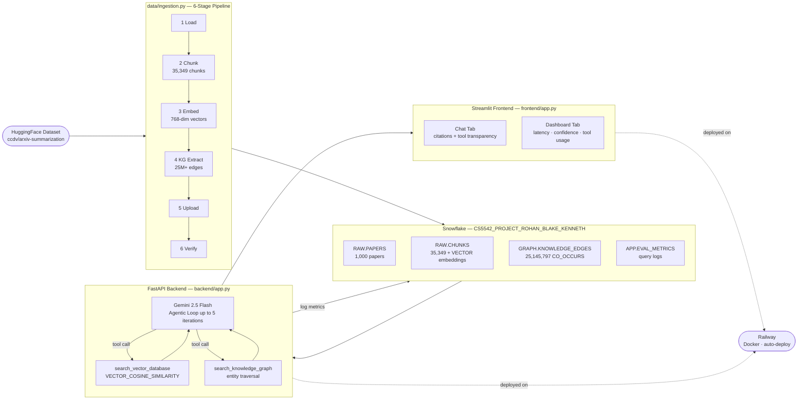

# Snowflake-Centered Personalized Research Assistant

> An autonomous AI research agent that answers questions about academic papers using agentic RAG, knowledge graph traversal, and Snowflake as the central data warehouse.

---

## Live Demo

| Service | URL |
|---|---|
| **Frontend (Streamlit)** | https://frontend-production-c6c11.up.railway.app |
| **Backend API** | https://backend-production-b66e.up.railway.app |
| **Health Check** | https://backend-production-b66e.up.railway.app/health |

---

## Team

| Name | GitHub |
|---|---|
| Blake Simpson | @EXC3ll3NTrhyTHM |
| Rohan Hashmi | @rohanhashmi2 |
| Kenneth Kakie | @kkkfc5 |

---

## What It Does

You ask a natural language question about academic research. The system activates an autonomous AI agent (Gemini 2.5 Flash) that iteratively searches a corpus of 1,000 arXiv papers using two tools — semantic vector search and knowledge graph traversal — gathering evidence over multiple reasoning steps before synthesizing a cited answer. Every query is logged to Snowflake for monitoring via a real-time metrics dashboard.

---

## System Architecture



---

## Quickstart

> **For full step-by-step instructions see [RUN.md](RUN.md)**

### Option A — Single command (recommended)

```bash
bash reproduce.sh
```

Validates Python 3.12+, creates venv, installs dependencies, starts the FastAPI backend, runs smoke tests, and launches the Streamlit frontend.

### Option B — Manual

```bash
# 1. Clone and set up
git clone https://github.com/BigDataAnalytics-CS5542/snowflake-research-assistant
cd snowflake-research-assistant
python3.12 -m venv venv
source venv/bin/activate
pip install -r requirements.txt

# 2. Configure environment
cp .env.example .env
# Fill in your credentials (see Environment Variables section below)

# 3. Create Snowflake schema
python scripts/run_sql_file.py sql/01_create_schema.sql

# 4. Run ingestion (one-time, ~1 hour)
python data/ingestion.py

# 5. Start backend
uvicorn backend.app:app --reload --port 3001

# 6. Start frontend
streamlit run frontend/app.py --server.port 3000
```

---

## Demo Instructions

### Using the Live App

1. Open https://frontend-production-c6c11.up.railway.app
2. Type a research question in the chat box (e.g. *"What methods improve retrieval-augmented generation?"*)
3. The agent will run up to 5 reasoning iterations, calling `search_vector_database` and `search_knowledge_graph` automatically
4. The response includes bracketed citations `[1]`, `[2]` tied to specific paper chunks
5. Expand **View Citations & Confidence** to see the source chunks, similarity scores, and paper titles
6. Switch to the **Dashboard** tab to see real-time system metrics — query latency, confidence distribution, tool usage breakdown, and the Snowflake table inventory

### Running Locally

After completing the Quickstart steps above, navigate to `http://localhost:3000`. If running with MFA, enter your Duo code in the sidebar before querying.

---

## Environment Variables

```bash
# Snowflake — required
SNOWFLAKE_ACCOUNT=your_account_identifier
SNOWFLAKE_USER=your_username
SNOWFLAKE_ROLE=your_role
SNOWFLAKE_WAREHOUSE=ROHAN_BLAKE_KENNETH_WH
SNOWFLAKE_DATABASE=CS5542_PROJECT_ROHAN_BLAKE_KENNETH
SNOWFLAKE_SCHEMA=RAW

# Authentication — pick one
SNOWFLAKE_PASSWORD=your_password          # local dev (with Duo MFA)
SNOWFLAKE_PRIVATE_KEY=                    # cloud deployment (RSA key-pair, raw PEM one-liner)

# LLM
GEMINI_API_KEY=your_gemini_key            # https://aistudio.google.com/app/apikey

# Deployment
BACKEND_URL=http://localhost:3001         # set to Railway URL for cloud deployment
```

---

## Dataset

**Source:** [`ccdv/arxiv-summarization`](https://huggingface.co/datasets/ccdv/arxiv-summarization) on HuggingFace  
**Domain:** Computer science and machine learning arXiv preprints  
**Size:** 1,000 papers streamed (no full download required)  
**Fields used:** `article` (full text), `abstract`  
**Preprocessing:** LaTeX markup removed, URLs stripped, whitespace normalized, papers with fewer than 50 words discarded

**Corpus statistics after ingestion:**

| Table | Rows | Description |
|---|---|---|
| RAW.PAPERS | 1,000 | Paper metadata |
| RAW.CHUNKS | 35,349 | Text segments (200 words, 30-word overlap) |
| GRAPH.KNOWLEDGE_NODES | 188,123 | Scientific entities (scispaCy NER) |
| GRAPH.KNOWLEDGE_EDGES | 25,145,797 | CO_OCCURS relationships |
| GRAPH.CHUNK_ENTITY_MAP | 1,631,712 | Chunk-to-entity links |

---

## Project Structure

```
snowflake-research-assistant/
├── backend/
│   ├── app.py              # FastAPI — agentic RAG loop, all API endpoints
│   ├── retrieval.py        # Vector search + knowledge graph retrieval
│   ├── logger.py           # Structured logging with request tracing
│   ├── Dockerfile          # CPU-only PyTorch (2.8 GB image)
│   └── requirements.txt    # Lean backend deps (no ingestion packages)
├── frontend/
│   ├── app.py              # Streamlit — chat UI + metrics dashboard
│   ├── Dockerfile
│   └── requirements.txt
├── data/
│   ├── ingestion.py        # 6-stage ingestion pipeline
│   └── config.py           # Centralized configuration
├── scripts/
│   ├── sf_connect.py       # Snowflake connection (MFA + key-pair auth)
│   └── run_sql_file.py     # SQL file executor
├── evaluation/
│   └── evaluate.py         # Metrics logging to APP.EVAL_METRICS
├── sql/
│   ├── 01_create_schema.sql      # Full schema (RAW, GRAPH, APP)
│   ├── 01-1_update_schema.sql    # Adds TOOL_CALLS + NUM_ITERATIONS columns
│   └── 02_migrate_to_vector_type.sql  # One-time migration for older installs
├── tests/
│   └── smoke_test.py       # Pytest smoke tests (no Snowflake required)
├── lab8_domain_adaptation/ # Domain adaptation experiment (legal demand)
│   ├── data/               # 50-example instruction dataset
│   ├── training/           # QLoRA fine-tuning + GEPA notebooks
│   └── evaluation/         # 4-config comparison evaluation
├── artifacts/              # Run summaries and frozen requirements
├── reproduce.sh            # Single-command local runner
├── RUN.md                  # Full setup guide
├── requirements.txt        # Full local dependencies
├── .env.example            # Environment variable template
└── .python-version         # Python 3.12
```

---

## API Reference

| Endpoint | Method | Description |
|---|---|---|
| `/health` | GET | Backend health check |
| `/health/snowflake` | GET | Snowflake connectivity + table row counts |
| `/auth` | POST | Authenticate Snowflake session (MFA mode) |
| `/query` | POST | Run agentic RAG query |
| `/history` | GET | Retrieve query history |
| `/metrics` | GET | Aggregated performance stats |
| `/metrics/history` | GET | Per-query metrics for dashboard charts |
| `/papers` | GET | List all papers in corpus |

---

## Reproducibility

The system is designed to be fully reproducible:

- **Single command:** `bash reproduce.sh` validates the environment, installs deps, starts both services, and runs smoke tests
- **Checkpointing:** The ingestion pipeline saves Parquet checkpoints after each stage — run with `--resume` to skip completed stages
- **Determinism:** Random seeds fixed (`random.seed(100)`, `np.random.seed(100)`) across ingestion and embedding stages
- **Pinned deps:** `artifacts/requirements_frozen.txt` contains 155 pinned packages from a working environment
- **Smoke tests:** `pytest tests/smoke_test.py` validates the backend without requiring a live Snowflake connection

See [reproducibility/README.md](reproducibility/README.md) and [LAB_7_REPORTS/REPRO_AUDIT.md](LAB_7_REPORTS/REPRO_AUDIT.md) for the full reproducibility audit.

---

## Configuration

All pipeline parameters are centralized in `data/config.py`:

```python
NUM_PAPERS           = 1000   # papers to ingest
CHUNK_SIZE_WORDS     = 200    # words per chunk
CHUNK_OVERLAP_WORDS  = 30     # overlap between chunks
EMBEDDING_MODEL      = "sentence-transformers/all-mpnet-base-v2"
EMBEDDING_DIM        = 768
SPACY_MODEL          = "en_core_sci_sm"
```

---

## Poster

> 🔗 **[Project Link (Google Slides)](https://docs.google.com/presentation/d/1GGYKNhI07vQA3K-Xk9h90Ihc7OdY8SzvEchBAxT4qWw/edit?usp=sharing)**

---

## Demo Video

> 🎥 **[Video link — coming soon]**

---

## Reports

| Report | Link |
|---|---|
| Project 3 Integrated Report | [reports/Project assignment 3 Report.docx](reports/Project%20assignment%203%20Report.docx) |
| Phase 2 Report | [reports/Phase 2 Report.pdf](reports/Phase%202%20Report.pdf) |
| Lab 7 Reports | [LAB_7_REPORTS/](LAB_7_REPORTS/) |
| Lab 9 Reports | [LAB_9_REPORTS/](LAB_9_REPORTS/) |
| Project 3 Individual Reports | [PROJECT_ASSIGNMENT_3_REPORTS/](PROJECT_ASSIGNMENT_3_REPORTS/) |
| Lab 8 Domain Adaptation | [lab8_domain_adaptation/](lab8_domain_adaptation/) |

---

## Tech Stack

| Layer | Technology |
|---|---|
| Data warehouse | Snowflake (VECTOR native type, INFORMATION_SCHEMA) |
| Embeddings | sentence-transformers/all-mpnet-base-v2 (768-dim) |
| NLP / KG | scispaCy en_core_sci_sm |
| LLM / Agent | Gemini 2.5 Flash (Google GenAI) |
| Backend | FastAPI + uvicorn |
| Frontend | Streamlit |
| Deployment | Railway (Docker, auto-deploy) |
| Auth | RSA key-pair (snowflake_jwt) for cloud; Duo MFA for local |