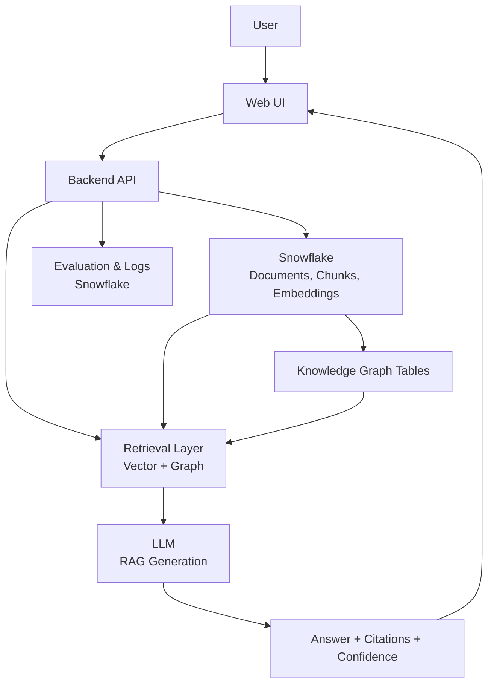

# A Snowflake-Centered Personalized Research Assistant
### with Retrieval-Augmented Generation, Knowledge Graphs, and Evaluation

**Course:** CS 5542 – Big Data Analytics and Applications  
**Project Type:** Team Project Proposal

---

## Team
- **Ron** (GitHub: @your-github-username)
- **Kenneth Kakie** (GitHub: @kenneth-github-username)
- **Blake Simpson** (GitHub: @blake-github-username)
- **Rohan Ashraf Hashmi** (GitHub: @rohan-github-username)

---

## Project Overview
Researchers face increasing difficulty navigating and synthesizing information across growing collections of scientific literature. Traditional keyword-based search tools lack semantic understanding, while large language model (LLM)–based assistants often hallucinate when not grounded in source material.

This project builds a **Personalized Research Assistant** that allows users to upload scientific papers and ask natural language questions over their own document corpus. The system returns **grounded answers with explicit citations and confidence indicators**, combining **Retrieval-Augmented Generation (RAG)** with **knowledge-graph–enhanced retrieval**. Snowflake serves as the central platform for data storage, retrieval, evaluation, and reproducibility.

---

## Objectives
- Enable question answering over **user-uploaded research papers**
- Ground all responses using **Retrieval-Augmented Generation (RAG)**
- Enhance retrieval with **knowledge graph structure**
- Provide **explicit citations** and **confidence indicators**
- Compare **standard RAG**, **fine-tuned RAG**, and **graph-enhanced RAG**
- Support **reproducible evaluation** in a Snowflake-centered pipeline

---

## System Architecture
The system is designed as a modular pipeline separating ingestion, retrieval, generation, and evaluation.



**Core components include:**
- Snowflake data layer (documents, chunks, embeddings, knowledge graph, evaluation metrics)
- Vector- and graph-based retrieval layer
- LLM-based generation constrained to retrieved context
- Evaluation and monitoring pipelines

---

## Datasets
The system leverages publicly available research corpora for ingestion and evaluation:

- **arXiv Scientific Papers Dataset**  
  https://www.kaggle.com/datasets/Cornell-University/arxiv

- **Scientific Papers (arXiv + PubMed OpenAccess)**  
  https://huggingface.co/datasets/armanc/scientific_papers

- **3M+ Academic Papers: Titles & Abstracts**  
  https://www.kaggle.com/datasets/beta3logic/3m-academic-papers-titles-and-abstracts

Datasets are ingested using Snowflake stages and processed via Snowpark.

---

## Related Work (NeurIPS 2025)
This project builds on recent advances in retrieval-augmented and structured reasoning systems:

- **GFM-RAG: Graph Foundation Models for Retrieval-Augmented Generation**  
  https://github.com/RManLuo/gfm-rag

- **GraphFlow / Knowledge-Graph–Based RAG**  
  https://neurips.cc/

- **Chain-of-Retrieval Augmented Generation**  
  https://neurips.cc/

These works inform the graph-enhanced retrieval strategy and evaluation design used in this project.

---

## Reproducibility
Reproducibility artifacts are documented in the `/reproducibility` directory.

- Dataset sources and versions are recorded
- Preprocessing and retrieval pipelines are scripted
- Experiments are configuration-driven
- Retrieval and evaluation metrics are logged in Snowflake
- Results can be reproduced using documented procedures

---

## Repository Structure
```
/README.md
/proposal        # Project proposal PDF
/docs            # Architecture diagrams and design notes
/data            # Dataset references and preprocessing scripts
/reproducibility # Experiment and environment setup
/backend         # API and retrieval orchestration
/frontend        # Web UI
/evaluation      # Benchmarks and metrics
```

---

## Project Status
This repository will be updated throughout the semester with system implementations, evaluation results, and documentation artifacts as the project progresses.
