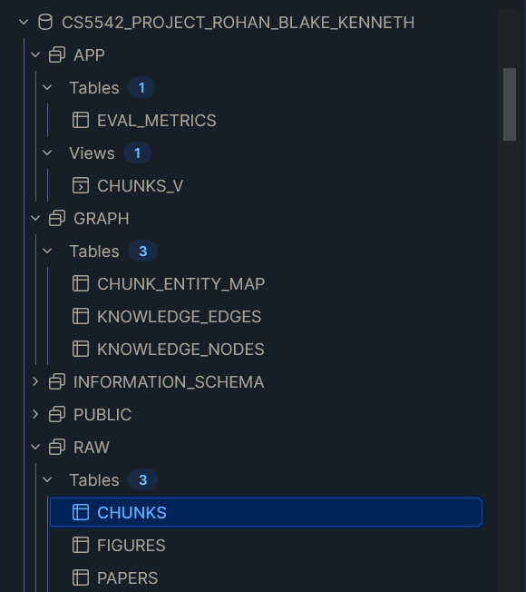
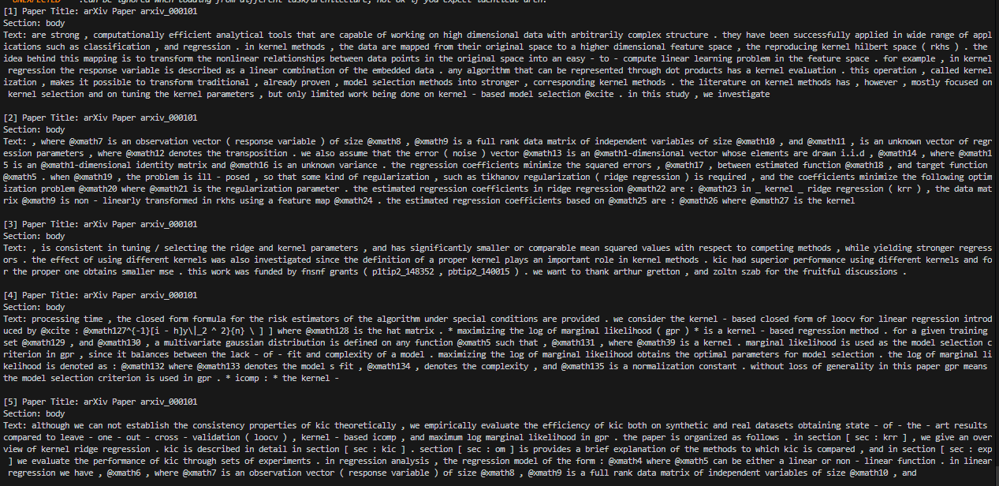
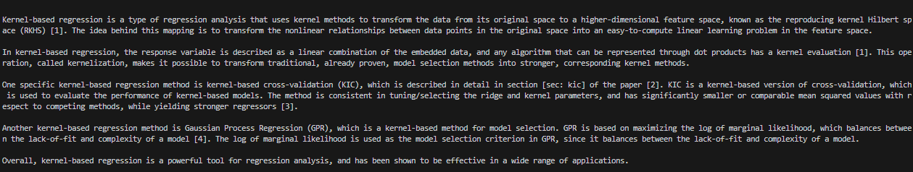
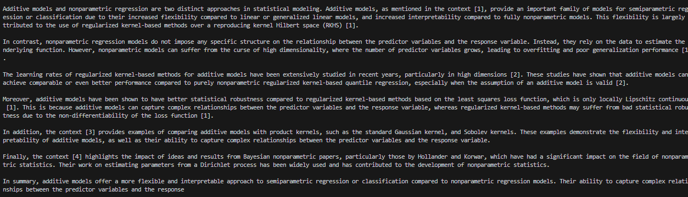

# Snowflake-Centered Personalized Research Assistant
### CS 5542 – Big Data Analytics and Applications

A RAG + Knowledge Graph research assistant powered by Snowflake, FastAPI, and Streamlit.  
**Lab 7 Update:** Upgraded to an Agentic RAG loop using Gemini 2.5 Flash with full reproducibility infrastructure.

---

## Team
| Name | GitHub |
|---|---|
| Rohan Ashraf Hashmi | @rohanhashmi2 |
| Kenneth Kakie | @kenneth-github |
| Blake Simpson | @blake-github |

---

## Lab 7 Changes (Reproducibility by Design)

| What Changed | Who | Details |
|---|---|---|
| Agentic RAG loop in `/query` | Blake | LLM now runs up to 5 reasoning iterations using `search_vector_database` and `search_knowledge_graph` tools before answering |
| Switched LLM to Gemini 2.5 Flash | Blake | Replaced Llama-3.2-3B with `google-genai` for tool calling support |
| Snowflake VECTOR migration | Blake | `EMBEDDING` column migrated from VARCHAR to native `VECTOR(FLOAT, 768)` for server-side similarity search |
| `reproduce.sh` | Rohan | Single command runs the full pipeline, smoke test, and both servers |
| `RUN.md` | Rohan | Step-by-step setup guide for a fresh clone |
| `tests/smoke_test.py` | Rohan | Smoke tests for `/health`, `/`, `/history` endpoints |
| Random seeds & determinism | Kenneth | Fixed seeds across ingestion and embedding stages |
| `REPRO_AUDIT.md` | Kenneth | Full audit of reproducibility checklist |

---

## Quickstart

> **For full step-by-step instructions see [RUN.md](RUN.md)**

### Option A — Single command (recommended)
```bash
bash reproduce.sh           # full run (~1 hour)
bash reproduce.sh --smoke   # skip ingestion, start backend, run smoke tests, start frontend with 10 papers
bash reproduce.sh --resume  # resume from existing checkpoints
```

### Option B — Manual steps

#### 1. Clone and set up environment
```bash
git clone <repo-url>
cd snowflake-research-assistant
python3.12 -m venv venv
source venv/bin/activate
pip install -r requirements.txt
```

#### 2. Configure environment
```bash
cp .env.example .env
# Fill in your credentials — see .env.example for all required variables
```

Required `.env` variables:
```
SNOWFLAKE_ACCOUNT=your_account
SNOWFLAKE_USER=your_username
SNOWFLAKE_PASSWORD=your_password
SNOWFLAKE_ROLE=your_role
SNOWFLAKE_WAREHOUSE=ROHAN_BLAKE_KENNETH_WH
SNOWFLAKE_DATABASE=CS5542_PROJECT_ROHAN_BLAKE_KENNETH
SNOWFLAKE_SCHEMA=RAW
GEMINI_API_KEY=your_gemini_key        # https://aistudio.google.com/app/apikey
HF_TOKEN=your_hf_token               # optional
```

#### 3. Create Snowflake schema
```bash
python scripts/run_sql_file.py sql/01_create_schema.sql
```

> **Note:** If you already had the database set up before Lab 7 (with VARCHAR embeddings),
> also run the migration script to convert to native VECTOR type:
> ```bash
> python scripts/run_sql_file.py sql/02_migrate_to_vector_type.sql
> ```
> Fresh installs do not need this — `01_create_schema.sql` already uses `VECTOR(FLOAT, 768)`.

#### 4. Run ingestion pipeline
```bash
python data/ingestion.py              # full run (~1 hour, 1000 papers)
python data/ingestion.py --resume     # resume from checkpoints
```

#### 5. Start backend
```bash
uvicorn backend.app:app --reload --port 3001
```

#### 6. Start frontend
```bash
streamlit run frontend/app.py --server.port 3000
```

---

## System Architecture

```
HuggingFace Dataset
        ↓
  data/ingestion.py  (Stages 1–6)
        ↓
  Snowflake (CS5542_PROJECT_ROHAN_BLAKE_KENNETH)
  ├── RAW.PAPERS             — paper metadata
  ├── RAW.CHUNKS             — text chunks + VECTOR(FLOAT, 768) embeddings
  ├── GRAPH.KNOWLEDGE_NODES  — extracted entities
  ├── GRAPH.KNOWLEDGE_EDGES  — co-occurrence edges
  ├── GRAPH.CHUNK_ENTITY_MAP — chunk ↔ entity links
  ├── APP.CHUNKS_V           — retrieval view
  └── APP.EVAL_METRICS       — query logs
        ↓
  backend/app.py  (FastAPI, port 3001)
  └── Agentic RAG loop (Gemini 2.5 Flash, up to 5 iterations)
      ├── search_vector_database  — VECTOR_COSINE_SIMILARITY server-side
      └── search_knowledge_graph  — entity relationship lookup
        ↓
  frontend/app.py  (Streamlit, port 3000)
```

---

## Project Structure
```
snowflake-research-assistant/
├── sql/
│   ├── 01_create_schema.sql       # Snowflake schema (RAW, GRAPH, APP)
│   └── 02_migrate_to_vector_type.sql  # One-time VECTOR migration (Lab 7)
├── data/
│   ├── config.py                  # Central config (model, chunking, paths)
│   ├── ingestion.py               # 6-stage ingestion pipeline
│   └── checkpoints/               # Parquet checkpoints (gitignored)
├── scripts/
│   ├── sf_connect.py              # Snowflake connection helper (MFA-aware)
│   └── run_sql_file.py            # Run SQL files against Snowflake
├── backend/
│   ├── app.py                     # FastAPI app — Agentic RAG loop (port 3001)
│   ├── retrieval.py               # Vector + graph retrieval (server-side VECTOR)
│   └── history.json               # Auto-generated query history
├── frontend/
│   └── app.py                     # Streamlit UI (port 3000)
├── evaluation/
│   └── evaluate.py                # RAGAS evaluation + Snowflake logging
├── tests/
│   └── smoke_test.py              # Smoke tests for backend endpoints (Lab 7)
├── artifacts/                     # Run outputs and summaries (Lab 7)
├── logs/                          # Ingestion and server logs (Lab 7)
├── docs/
│   └── architecture.png           # Pipeline diagram
├── reproducibility/
│   └── README.md                  # Reproducibility notes
├── reproduce.sh                   # Single-command runner (Lab 7)
├── RUN.md                         # Full setup instructions (Lab 7)
├── REPRO_AUDIT.md                 # Reproducibility audit checklist (Lab 7)
├── requirements.txt               # Pinned dependencies (Lab 7)
├── .env.example                   # Environment variable template
├── CONTRIBUTIONS.md
└── README.md
```

---

## Ingestion Pipeline Details

The pipeline runs in 6 stages, each with checkpoint support:

| Stage | Script Function | Output |
|---|---|---|
| 1. Load | `load_and_clean_dataset()` | 1000 arXiv papers, cleaned text |
| 2. Chunk | `chunk_documents()` | ~36,000 chunks (200 words, 30 overlap) |
| 3. Embed | `generate_embeddings()` | 768-dim vectors (all-mpnet-base-v2) |
| 4. KG Extract | `extract_knowledge_graph()` | Entities, edges, chunk-entity map |
| 5. Upload | `upload_to_snowflake()` | All tables populated in Snowflake |
| 6. Verify | `verify_ingestion()` | Row count validation |

**Embedding model:** `sentence-transformers/all-mpnet-base-v2` (768-dim, L2-normalized)  
**Dataset:** `ccdv/arxiv-summarization` (arXiv papers, HuggingFace)  
**KG extraction:** scispaCy `en_core_sci_sm` (scientific NER)

---

## Snowflake Schema

Database: `CS5542_PROJECT_ROHAN_BLAKE_KENNETH`  
Warehouse: `ROHAN_BLAKE_KENNETH_WH`

```sql
-- Verify all tables
SELECT TABLE_SCHEMA, TABLE_NAME, TABLE_TYPE
FROM INFORMATION_SCHEMA.TABLES
WHERE TABLE_SCHEMA IN ('RAW', 'GRAPH', 'APP')
ORDER BY TABLE_SCHEMA, TABLE_NAME;
```

---

## Configuration

All pipeline parameters are in `data/config.py`:

```python
NUM_PAPERS          = 1000    # papers to ingest
CHUNK_SIZE_WORDS    = 200     # words per chunk
CHUNK_OVERLAP_WORDS = 30      # overlap between chunks
EMBEDDING_MODEL     = "sentence-transformers/all-mpnet-base-v2"
EMBEDDING_DIM       = 768
SPACY_MODEL         = "en_core_sci_sm"
```

---

## Requirements

- **Python:** 3.12
- **Snowflake:** EDU or Enterprise account (must support `VECTOR` type)

Key dependencies (see `requirements.txt` for full list):
- `google-genai>=1.0.0` — Gemini 2.5 Flash for Agentic RAG (added Lab 7)
- `snowflake-snowpark-python>=1.12.0`
- `sentence-transformers>=2.2.2`
- `fastapi>=0.109.2`
- `streamlit>=1.30.0`
- `scispacy>=0.6.0`

---

## Snowflake / SQL Screenshots

# Snowflake Schema


(SQL File hosted in ./sql)

---

## Backend - Query Screenshots

# Retrieved Chunks


# LLM Formatted Response


# Query 2 LLM Response:


---

## Individual Contributions

See [CONTRIBUTIONS.md](CONTRIBUTIONS.md) for detailed breakdown.