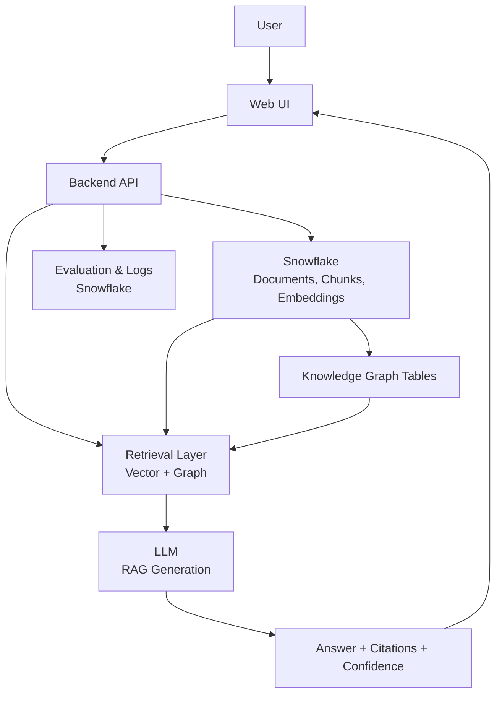

# **A Snowflake-Centered Personalized Research Assistant with RAG, Knowledge Graphs, and Evaluation**

## CS 5542 \- Big Data Analytics and Applications

## Project Proposal

### **Team Members**

* Blake Simpson  
* Kenneth Kakie  
* Rohan Ashraf Hashmi

### **Github:** 

[https://github.com/BigDataAnalytics-CS5542/snowflake-research-assistant](https://github.com/BigDataAnalytics-CS5542/snowflake-research-assistant)  

---

## **Abstract**

The rapid growth of scientific literature has made it increasingly difficult for researchers to efficiently search, synthesize, and validate information across large personal collections of papers. While large language models (LLMs) offer powerful natural language interfaces, they suffer from hallucinations and lack transparency when operating without grounding in source material.

In this project, we propose a Snowflake-centered Personalized Research Assistant that combines Retrieval-Augmented Generation (RAG) with knowledge-graph–enhanced retrieval to provide grounded, explainable, and structured answers over user-uploaded research papers. Our system allows users to upload documents, ask natural language questions, receive cited responses with confidence scores, and explore relationships between papers, concepts, and methods through graph-based reasoning.

To ensure research-grade rigor, we incorporate an evaluation pipeline comparing standard RAG against fine-tuned and graph-enhanced retrieval strategies, measuring accuracy, citation correctness, latency, and scalability. The final deliverable is a working web-based prototype backed by a reproducible Snowflake data pipeline, demonstrating how structured intelligence and GenAI can be combined into a deployable research assistant rather than a simple LLM demo.

---

## **1\. Problem Statement and Objectives**

### **1.1 Problem Statement**

Researchers today face an overwhelming volume of scientific publications across disciplines, conferences, and journals. Even within a single research area, it is common for individuals to manage hundreds of PDFs containing overlapping concepts, methods, and results. Traditional keyword search tools fail to capture semantic relationships across documents, while LLM-based chat systems often generate unverified or hallucinated answers when operating without strong grounding.

Moreover, existing research tools rarely provide visibility into why an answer was produced, how confident the system is, or how information from multiple papers is connected. This lack of transparency limits trust and reduces the usefulness of AI systems for serious academic and industrial research.

### **1.2 Target Users**

* Graduate students conducting literature reviews  
* Academic researchers synthesizing results across papers  
* Industry R\&D teams maintaining internal research corpora

### **1.3 Objectives**

The primary objectives of this project are to:

* Build a personalized research assistant over user-uploaded scientific documents  
* Ground all generated responses in source text using Retrieval-Augmented Generation (RAG)  
* Enhance retrieval and reasoning using knowledge-graph–based structure  
* Provide citations and confidence estimates for generated answers  
* Evaluate different retrieval strategies (RAG vs. fine-tuned vs. graph-enhanced)  
* Design a Snowflake-centered, reproducible, and scalable system architecture

---

## **2\. Project Evolution and Innovation Layer**

Our pre-proposal introduced two separate project ideas: a Personal Research Assistant and a Knowledge Graph Research Explorer. Based on instructor feedback emphasizing the need for greater technical ambition, we integrate these ideas into a single unified system.

Rather than treating knowledge graphs as a standalone product, this project incorporates knowledge-graph extraction as an internal intelligence layer within the research assistant. Entities such as papers, authors, methods, datasets, and citations are automatically extracted and modeled as a lightweight graph. This structure enables advanced retrieval strategies, cross-document reasoning, and optional graph-based exploration, while keeping the primary user interaction centered on natural language question answering.

This integration directly addresses the instructor’s recommendation to expand beyond basic RAG by introducing graph-based queries and structured retrieval, elevating the system from a standard class assignment to a research-oriented prototype.

---

## **3\. System Overview**

At a high level, the proposed system consists of five major components:

1. #### **Document Ingestion Pipeline**

   User-uploaded PDFs are processed, chunked, embedded, and stored using Snowflake stages and tables.

2. #### **Vector and Graph Storage**

   Text embeddings support semantic retrieval, while extracted entities and relationships form a lightweight knowledge graph.

3. #### **Retrieval Layer**

   Relevant passages and subgraphs are retrieved based on the user query.

4. #### **Generation Layer**

   An LLM generates grounded answers using retrieved context, citations, and confidence estimation.

5. #### **Evaluation and Monitoring**

   Retrieval strategies are compared using offline benchmarks and runtime metrics.

This architecture enables modular experimentation while remaining deployable in a production-like environment.

---

## **4\. Related Work (NeurIPS 2025\)**

###  **4.1 GFM-RAG: Graph Foundation Model for Retrieval Augmented Generation** 

Paper link: [https://neurips.cc/virtual/2025/poster/120321](https://neurips.cc/virtual/2025/poster/120321)  
Code link: [https://github.com/RManLuo/gfm-rag](https://github.com/RManLuo/gfm-rag)

####  **Summary:**

GFM-RAG introduces a graph foundation model that builds a knowledge graph index from documents to improve retrieval performance for RAG tasks. Instead of only using standard vector search, it leverages graph neural networks to capture complex relationships between pieces of knowledge and obtain more relevant context for an LLM to generate answers. This method demonstrates better handling of multi-source reasoning by explicitly modeling inter-entity relations.

### 

#### **Project integration:**

Our proposal’s KG layer can leverage concepts from GFM-RAG’s graph indexing to structure paper metadata and entity connections (e.g., authors, methods, citations) inside Snowflake. The graph index could inform advanced retrieval queries that complement vector search, improving answer quality and explainability in our system.

### **4.2 Can Knowledge-Graph-based Retrieval Augmented Generation Really Retrieve What You Need?** 

Paper link: [https://neurips.cc/virtual/2025/poster/115922](https://neurips.cc/virtual/2025/poster/115922)

####  **Summary:**

This work examines the effectiveness of knowledge-graph-based RAG methods and proposes GraphFlow, a framework that retrieves accurate and diverse knowledge from text-rich knowledge graphs for real queries. Unlike traditional RAG relying solely on vectors, this method emphasizes structured retrieval over graph embeddings and dynamic retrieval paths tailored to query needs.

### 

#### **Project integration:**

GraphFlow’s structured retrieval ideas directly inform our advanced retrieval layer. In the research assistant, we can incorporate GraphFlow-inspired approaches to improve how we fetch context for a query from a constructed graph of research entities, then fuse that with vector-based context before generation.

### **4.3 Chain-of-Retrieval Augmented Generation** 

Paper link: [https://neurips.cc/virtual/2025/poster/116740](https://neurips.cc/virtual/2025/poster/116740)

####  **Summary:**

This paper proposes a multi-step RAG framework that performs sequential retrieval and reasoning before final generation. Instead of a single retrieval step, it uses iterative retrieval to refine context for complex queries, which significantly improves the relevance and completeness of the final generated answer.

### 

#### **Project integration:**

Our research assistant will benefit from this paper’s sequential retrieval strategy. Inside our pipeline, we can implement a similar multi-stage retrieval approach where we first retrieve broadly relevant chunks, optionally filter/refine with graph context, and then perform a second retrieval round before passing the refined context to the LLM for answer generation.

### **4.4 How These Papers Fit Our Snowflake Pipeline**

| Paper | Snowflake Integration | Purpose |
| ----- | ----- | ----- |
| **GFM-RAG** | Graph indexing stored in Snowflake tables \+ graph execution via a graph engine | Enhances retrieval with structural relationships |
| **KG-RAG (GraphFlow)** | Use Snowflake to query structured KG info and combine with semantic vectors | More accurate and diverse retrieval |
| **Chain-of-Retrieval** | Iterative retrieval workflows expressed in Snowpark jobs or stored procedures | Repeated refinement of context before generation |

---

## **5\. Data Sources & Snowflake Ingestion Plan**

For our Snowflake-centered Personalized Research Assistant, we need datasets that give us real scientific papers, textual content to retrieve from, and potential QA benchmarking ability. Below are three high-value datasets that align with these needs, along with ingestion plans suitable for a Snowflake analytics \+ GenAI pipeline.

### **5.1 arXiv Scientific Papers Dataset**

Dataset link: Kaggle – arXiv dataset and metadata of 1.7M+ scholarly papers  
URL: [https://www.kaggle.com/datasets/Cornell-University/arxiv](https://www.kaggle.com/datasets/Cornell-University/arxiv)

#### **Description:**

A richly featured corpus of more than 1.7 million research papers across STEM disciplines. This dataset includes metadata such as titles, abstracts, authors, categories, and full text (where available). It is a foundational resource for building retrieval and indexing systems over research literature.

#### **Why it fits:**

* Provides a large, open corpus for ingestion.  
* Metadata supports entity extraction (authors, terms, keywords) useful for knowledge graph construction.  
* Works as the primary document source for our RAG system.

#### **Ingestion Plan (Snowflake):**

1. Export the compressed dataset (CSV/Parquet) to a Snowflake stage (e.g., AWS S3).  
2. Create external or internal Snowflake tables for:  
   * Paper metadata (title, authors, categories)  
   * Full text / abstracts (long text)  
3. Use Snowpipe for any incremental updates if we extend with new papers.  
4. Create views for semantic chunking pipelines.

This dataset forms the backbone of our RAG pipeline because the LLM will need to retrieve specific paper contexts and citations.

### **5.2 Scientific Papers (ArXiv \+ PubMed) from Hugging Face Datasets**

Dataset link: Hugging Face – armanc/scientific\_papers  
URL: [https://huggingface.co/datasets/armanc/scientific\_papers](https://huggingface.co/datasets/armanc/scientific_papers)

#### **Description:**

This dataset combines two large repositories \- ArXiv and PubMed OpenAccess scientific articles \- in structured JSON format. Each entry includes the full body of the paper, section boundaries, and abstract text.

#### **Why it fits:**

* Contains long-form structure (organized sections), which improves chunking quality for semantic search.  
* Enables training or benchmarking of models on real long documents rather than short abstracts.

#### **Ingestion Plan (Snowflake):**

1. Download the Hugging Face dataset into cloud storage (S3 or GCS).  
2. Load the data via Snowflake stages into:  
   * papers\_structured table with article, abstract, section\_names  
   * JSON columns for flexible schema evolution  
3. Use Snowpark Python to preprocess:  
   * split sections into chunks  
   * extract embeddings per chunk  
4. Populate a vector store in Snowflake or external vector DB integrated with Snowflake.

Because this dataset maintains individual section boundaries, it supports enhanced retrieval beyond coarse document chunks.

### **5.3 Academic Papers: Titles & Abstracts**

Dataset link: Kaggle \- 3M+ Academic Papers: Titles & Abstracts  
URL: [https://www.kaggle.com/datasets/beta3logic/3m-academic-papers-titles-and-abstracts](https://www.kaggle.com/datasets/beta3logic/3m-academic-papers-titles-and-abstracts)

#### **Description:**

A broad collection of over 3 million research paper titles and abstracts compiled from multiple sources. While it does not always include full paper text, it provides a massive pool of abstracts and metadata that can be used for fast retrieval, indexing, and facet-based search.

#### **Why it fits:**

* Increases the breadth of our corpus significantly.  
* Useful for coarse indexing and learning high-level semantic structures.  
* Abstracts are frequently sufficient for first-stage retrieval in multi-stage RAG pipelines.

#### **Ingestion Plan (Snowflake):**

1. Load the dataset into Snowflake via staged files.  
2. Create a table of abstracts with indexing on title, year, and categories.  
3. Generate embeddings for abstracts and titles to power quick semantic filtering.  
4. Use abstracts first during retrieval to narrow down candidate documents.

This dataset serves as a fast filtering layer before deeper retrieval from full-text sources (arXiv and Hugging Face).

### **Snowflake Pipeline Sketch (How It All Connects)**

Here’s how these datasets fit into a reproducible Snowflake workflow:

1. **Data Ingestion**  
   * Export datasets to cloud storage (S3 / GCS).  
   * Use Snowflake stages \+ COPY INTO to load into structured tables.  
2. **Processing & Semantic Prep**  
   * Use Snowpark Python to:  
     * Chunk documents (split by sections or fixed length)  
     * Extract embeddings (per chunk and abstract)  
     * Store embeddings in a vector structure (Snowflake vector support or external store)  
3. **Knowledge Graph Layer**  
   * Run entity extraction (authors, methods, keywords) on metadata \+ full text.  
   * Populate entity tables (paper\_entity, author\_entity, term\_entity).  
   * Populate relationship tables (paper\_cites, author\_wrote, term\_in\_paper).  
4. **Retrieval Layer**  
   * Use vector search \+ graph queries to select candidate texts.  
   * Combine results for the RAG model’s context.  
5. **Generation \+ Evaluation**  
   * Generate answers using grounded context.  
   * Compare RAG only vs. KG-augmented retrieval in evaluation metrics.

---

## **6\. Methods, Technologies, and System Architecture**

This section outlines the end-to-end system design of the Personalized Research Assistant and how Retrieval-Augmented Generation (RAG) is enhanced with knowledge-graph–based retrieval to improve grounding, explainability, and cross-document reasoning.

---

### **6.1 System Architecture Overview**

The system is organized as a modular pipeline with four core components:

* **Data Layer (Snowflake-centered):** stores documents, chunks, embeddings, and extracted entities  
* **Retrieval Layer:** combines vector-based semantic search with graph-based filtering  
* **Generation Layer (LLM):** produces grounded answers with citations  
* **Evaluation Layer:** logs answer quality and system performance metrics

*Figure 1 shows the high-level system architecture.*

This modular design enables experimentation without reworking the entire system.

### **6.2 Document Processing and Retrieval**

Uploaded documents are processed using **Snowpark Python**, where text is split into semantic chunks based on section or paragraph boundaries. Each chunk is stored with identifiers and source metadata, enabling accurate citation and traceability.

Chunks and abstracts are embedded using a pretrained model for scientific text. Retrieval follows a two-stage approach: an initial vector-based search to identify candidate passages, followed by re-ranking using metadata and optional graph-based constraints to balance precision and recall.

### **6.3 Knowledge Graph–Enhanced Retrieval**

To address limitations of standard RAG, the system incorporates a lightweight knowledge graph extracted from user-uploaded papers. Entities such as papers, authors, methods, and concepts, along with relationships like citations and method usage, are stored as normalized Snowflake tables.

During retrieval, graph relationships are used to prioritize closely connected or authoritative papers, improving cross-document reasoning, consistency, and explainability while reducing hallucinations.

### **6.4 Generation and Evaluation Design**

Answers are generated by an LLM constrained to retrieved context and returned with explicit citations and confidence indicators derived from retrieval consistency.

The system supports comparative evaluation across standard RAG, fine-tuned RAG, and graph-enhanced RAG using identical datasets and queries, enabling controlled analysis of how advanced retrieval strategies affect answer quality.

---

## **7\. Infrastructure, Deployment, and Monitoring**

To ensure the system functions as a research-grade prototype rather than a conceptual demo, we design the infrastructure with deployment realism, scalability, and observability in mind. The architecture mirrors production systems while remaining lightweight enough for academic development.

### **7.1 Deployment Architecture**

The system follows a modular service-oriented design that separates data management, retrieval logic, and user interaction.

* **Backend Services**  
   A lightweight API layer handles document upload, query submission, retrieval orchestration, and response assembly. This layer interfaces with Snowflake for data access and analytics and with the LLM provider for generation.  
* **Snowflake Data Platform**  
   Snowflake serves as the central system of record for ingested papers, chunked text, embeddings, knowledge graph entities, and evaluation metrics. Snowpark jobs support preprocessing, embedding generation, and scheduled evaluation tasks.  
* **Frontend Interface**  
   A web-based UI enables users to upload papers, submit queries, and view grounded answers with citations and confidence indicators, with optional exploration of related papers or concepts.

This separation allows independent iteration on retrieval strategies, UI design, and evaluation logic without destabilizing the system.

### **7.2 Cloud and Runtime Environment**

The system is designed to run on standard cloud infrastructure (e.g., AWS or GCP) while remaining cloud-agnostic. Backend services are containerized for reproducibility, APIs are stateless, and Snowflake maintains persistent state.

Snowflake role-based access control enforces user-scoped data isolation, ensuring that each user’s documents and embeddings are accessible only within their assigned role. Evaluation and monitoring tables are exposed through read-only roles to support governance and reproducibility without risking data integrity.

### **7.4 Reproducibility, Scalability, and Extensibility**

All code and documentation are maintained in a shared GitHub repository, with dataset versions, preprocessing steps, and experiment configurations explicitly documented. Snowflake tables store experiment identifiers alongside results to enable repeatable and auditable comparisons.

While the prototype targets a limited initial scale, the architecture supports growth through Snowflake’s scalable storage and parallel retrieval and generation components. Future extensions may include richer graph analytics, domain-specific fine-tuning, and enhanced visualization of research relationships.

---

## **8\. Expected Outcomes and Evaluation Metrics**

This section defines the concrete outcomes and evaluation criteria used to assess the success of the proposed Personalized Research Assistant. Rather than relying on qualitative impressions, we focus on measurable metrics aligned with accuracy, grounding, transparency, and scalability.

### **8.1 Expected System Outcomes**

By the end of the project, we will deliver a functional research assistant prototype that enables users to:

* Upload scientific papers and build a personalized document corpus  
* Ask natural language questions over their uploaded documents  
* Receive grounded answers with:  
  * explicit citations to source documents or sections  
  * confidence indicators based on retrieval consistency  
* Compare multiple retrieval strategies, including:  
  * standard RAG  
  * fine-tuned RAG  
  * knowledge-graph–enhanced RAG

These outcomes emphasize explainability and trust, which are critical for real-world research use.

### **8.2 Live Demo Scope**

The final demo will showcase:

* Document upload with automatic preprocessing and indexing  
* Question answering with cited and confidence-scored responses  
* Side-by-side comparison of standard RAG and graph-enhanced retrieval  
* Visualization of retrieval metrics and citation coverage

This demo highlights how retrieval design choices impact answer quality.

### **8.3 Evaluation Metrics**

Evaluation focuses on answer quality and system performance.

**Answer Quality Metrics**

* **Answer Accuracy** – alignment with reference answers where available  
* **Citation Correctness** – whether cited passages support the answer  
* **Context Coverage** – proportion of relevant documents retrieved

**System Metrics**

* **Retrieval Precision and Recall**  
* **Latency** – end-to-end response time  
* **Scalability** – performance as corpus size increases  
* **Hallucination Rate** – answers lacking sufficient citation support

All metrics are logged in Snowflake to enable repeatable analysis.

### **8.4 Comparative Evaluation and Success Criteria**

Using a fixed set of queries and documents, we will compare standard RAG, fine-tuned RAG, and graph-enhanced retrieval under identical conditions. This allows us to isolate the impact of structured retrieval on answer quality.

The project will be considered successful if:

* The system consistently produces grounded, cited answers  
* Graph-enhanced retrieval improves citation quality and cross-document reasoning  
* Evaluation results are reproducible across multiple runs

---

## **9\. Reproducibility, Repository Structure, and Project Timeline**

A core objective of this project is to ensure that all results, experiments, and system behaviors are reproducible and auditable. To support this, we emphasize disciplined repository organization, clear documentation, and a well-defined development timeline.

### **9.1 GitHub Repository Structure ([repo link here](https://github.com/BigDataAnalytics-CS5542/snowflake-research-assistant))**

All project artifacts will be maintained in a shared team GitHub repository accessible to all members. The repository is organized to support collaboration, transparency, and reproducibility.

Planned repository structure:

`/README.md`  
`/proposal`  
`/docs`  
`/data`  
`/reproducibility`  
`/backend`  
`/frontend`  
`/evaluation`

* **README.md**  
   Project overview, objectives, team members, system architecture diagram, dataset links, and related work references.  
* **/proposal**  
   Final proposal PDF and any submitted revisions.  
* **/docs**  
   System architecture diagrams and design notes.  
* **/data**  
   Dataset references and preprocessing scripts (raw data excluded).  
* **/reproducibility**  
   Environment setup instructions and experiment configuration templates.  
* **/backend / /frontend**  
   Application source code and API/UI components.  
* **/evaluation**  
   Benchmark queries, evaluation scripts, and metrics aggregation.

This structure ensures that another researcher or evaluator can reproduce the system without relying on undocumented assumptions.

### **9.2 Reproducibility Strategy**

Reproducibility is supported at both the data and model levels through:

* **Versioned datasets**, with sources and preprocessing steps explicitly documented  
* **Configuration-driven experiments**, where retrieval strategies and model parameters are logged per run  
* **Logged results**, with retrieval metrics, outputs, and performance statistics stored in Snowflake tables  
* **Deterministic evaluation where possible**, with fixed random seeds and documented sources of nondeterminism

These practices enable side-by-side comparison of experiments and traceability of performance changes.

### **9.3 Collaboration and Role Alignment**

Team responsibilities align with the system’s modular design:

* **Backend & Retrieval**: document ingestion, retrieval orchestration, and RAG integration  
* **Data Infrastructure & MLOps**: Snowflake pipelines, Snowpark processing, and evaluation logging  
* **Frontend & Visualization**: user interface for document upload, querying, and result presentation

Clear role delineation supports parallel development while maintaining system coherence.

### **9.4 Project Timeline and Milestones**

The project will be executed in structured phases:

* **Phase 1 — Data & Ingestion Setup**  
   Dataset finalization, Snowflake ingestion, preprocessing validation  
* **Phase 2 — Core RAG System**  
   Vector retrieval, LLM generation with citations, baseline evaluation  
* **Phase 3 — Knowledge Graph Integration**  
   Entity extraction, graph-enhanced retrieval, comparative analysis  
* **Phase 4 — Evaluation & Refinement**  
   Benchmark execution, metric analysis, system optimization  
* **Phase 5 — Final Demo & Documentation**  
   Live demo preparation, documentation finalization, reproducibility packaging

This phased approach ensures steady progress while keeping the system functional throughout development.

---

## **10\. Conclusion**

This project proposes a Snowflake-centered Personalized Research Assistant that addresses the growing challenge of navigating and synthesizing large collections of scientific literature. By combining Retrieval-Augmented Generation (RAG) with knowledge-graph–enhanced retrieval, the system moves beyond standard LLM-based question answering toward a more structured, explainable, and evaluable research tool.

Unlike generic chat-based assistants, the proposed system grounds all responses in user-provided documents, provides explicit citations and confidence indicators, and incorporates structured relationships between papers, authors, methods, and concepts. This design directly addresses known limitations of existing approaches and aligns with the instructor’s feedback to expand technical ambition through advanced retrieval and graph-based reasoning.

The Snowflake-centered architecture supports scalable data ingestion, semantic retrieval, graph analytics, and rigorous evaluation within a unified platform. By treating evaluation, monitoring, and reproducibility as first-class concerns, the project emphasizes research rigor while remaining practical and deployable.

Overall, this work demonstrates how structured intelligence, data engineering, and generative AI can be combined to build a trustworthy and extensible research assistant. The methods and infrastructure outlined here provide a strong foundation for future extensions such as domain-specific fine-tuning, richer graph analytics, and broader application to enterprise knowledge management systems.

[image1]: <data:image/png;base64,iVBORw0KGgoAAAANSUhEUgAAAnAAAAKxCAYAAADTp5GyAABGvElEQVR4Xu3d3bMk510n+PmfxI0uHHEMEV4i1G1HcGMJHFwg3JgNSwu7DqZZIraFYmaXdYiLDcYjCQYPzc7GBCu/QEs7toG1kXmR0bZ2Y1jCxMojwIjuHVBLNp6VMfZItf4d8Tt+znOy6pysk5mVT+bnE/GNrsrMynrpqqzveTKr6p9sAABoyj+pJwAAMG8KHABAYxQ4AIDGKHAAAI1R4AAAGqPAAU341jff2vzBb722+ePPvi478vvffYyA5VPggGZ8/MZfbP7gua9tvvCp16Ujv//dx+aXf/aV+mEDFkiBA5rx9PVXNne++p3NvXsb6chf/fl3FDhYCQUOaEYUuL/+SwVuWxQ4WA8FDmiGArc7ChyshwIHNEOB2x0FDtZDgQOaocDtjgIH66HAAc1Q4HZHgYP1UOCAZihwu6PAwXoocEAzFLjdUeBgPRQ4oBkK3O4ocLAeChzQDAVudxQ4WA8FDmiGArc7ChyshwIHNEOB2x0FDtZDgQOaocDtjgIH66HAAc1Q4HZHgYP1UOCAZihwu6PAwXoocEAzFLjdUeBgPRQ4oBlTFLj77rtv89xzz5+cf/XVNzcPP/yhzfXrN84sO7cocLAeChzQjKf+qQK3KwocrIcCBzRjDgUu/o1lMrncyy+/trly5X3H046O3r154YUvH09/8smbx9Mff/yjx/M+97kXzlznUFHgYD0UOKAZcyhwZTnLxPmYHmUtzse/uZ48HeuIddXXN2QUOFgPBQ5oxhwKXD0/EvPKXazlZaLAdZW+MaLAwXoocEAz5lDgymmxbO463XaMXO5CjeXqeUNHgYP1UOCAZkxR4GK0rCxwWdBy92iZKG1/8id/dVzmtu0iVeCAMShwQDOmKHBRxMpdnlHStu0CjXlRzPIYuByFi/PxoYU4rcABY1DggGZMUeAi5SdN6/JVfgI1SltOzxKX827e/MTxiJwCB4xBgQOaMVWBazUKHKyHAgc0Q4HbHQUO1kOBA5qhwO2OAgfrocABzVDgdkeBg/VQ4IBmKHC7o8DBeihwQDMUuN1R4GA9FDigGQrc7ihwsB4KHNAMBW53FDhYDwUOaIYCtzsKHKyHAgc0Q4HbHQUO1kOBA5qhwO2OAgfrocABzVDgdkeBg/VQ4IBmKHC7o8DBeihwQDMUuN1R4GA9FDigGQrc7ihwsB4KHNCMp6+/srnzVQVuW179SwUO1kKBA5rx8Rt/sfnSb39984VPvi4d+f1nv7b51z//F/XDBiyQAgc04VvffGvz+d/4282Ln3tDduQPbt07fqyAZVPgAAAao8ABADRGgQMAaIwCBwDQGAUOAKAxChwAQGMUOACAxihwAACNUeAAABqjwAEANEaBAwBojAIHANAYBQ4AoDEKHABAYxQ4AIDGKHAAAI1R4AAAGqPAAQA0RoEDAGiMAgcA0BgFDgCgMQocAEBjFDgAgMYocAAAjVHgAAAao8ABADRGgQMAaIwCBwDQGAUOAKAxChwAQGMUOACAxihwAACNUeAAevi1X/u1zX333deZT3/60/XiAKNQ4AB6+MY3vrE5Ojo6U95i2t27d+vFAUahwAH09NBDD50pcI888ki9GMBoFDiAPZQlTnkDpqbAAezhzp07x7tNI7dv365nA4xKgQNm4+236inzFqNwrY2+vfXW2/UkoEEKHDAbX/ubb29+/9Ovbf74M683kd/9X/9y8+lf/b/PTJ9rvvipv9387V9/q37YgQYpcMBs/H9f/87m6et/vrl3byMj5Kl/+srmm//pP9cPO9AgBQ6YDQVu3ChwsBwKHDAbCty4UeBgORQ4YDYUuHGjwMFyKHDAbChw40aBg+VQ4IDZUODGjQIHy6HAAbOhwI0bBQ6WQ4EDZkOBGzcKHCyHAgfMhgI3bhQ4WA4FDpgNBW7cKHCwHAocMBsK3LhR4GA5FDhgNhS4caPAwXIocMBsKHDjRoGD5VDggNlQ4MaNAgfLocABs6HAjRsFDpZDgQNmo5UC9/LLr22uXHnf5sknb56ZN+cocLAcChwwG1MUuBdffHnz3HPPn5r2+OMfPXX++vUbm4cf/tDm1VffPHP5SJ8Cl8vGOsvpcdmYF6dfeOHLm6Ojd5+57NBR4GA5FDhgNqYocF/96n86U6aiYGWZukg5u8gy9bL1dSpwwGUocMBsTFHgIuXoWvx73333nYzKxb9RpqJU1ZfLKHDAoSlwwGxMVeDK8hWF7ZlnPnMyChflLstWzCt3t8b0KFtZymLZXC5KYF3SIgocMAYFDpiNqQpceYxbnM6SlaNv8W/My4KWieWyeNUjcHG6q4QpcMAYFDhgNqYqcFHQolR96Ut/tnnwwQ8cT4tCFSUrR+KyVMXIWpltBW5bCVPggDEocMBsTFXgylKVo2xRoh544L0nRWtXqVLggENT4IDZmKrARbo+rFCWqlymLGl5PFxdyurzdWIdOXqX64nzOV+BA/pS4IDZmLLARemKwlV+11vXJ0/L3adZsuKysev1iSc+dmrXan3ZMlnaMuWHIxQ4oC8FDpiNKQvcGqPAwXIocMBsKHDjZluB+/rXv7759re/XU8GZkyBA2ZDgRs3UeCe+tjHNw8//PDm6Ojo1C5doC0KHDAbCty4efJn/sPm6F3/xanipsBBmxQ4YDYUuHETBe4XP/pLm/vvv/9MgXvsscc2N27c2Ny6dWtz+/bt+r8GmBkFDpiFO3fubP7oiy8pcCMmj4GLx7rehRrFLUpc5Nq1a5srV64cn47pEWBeFDhgMlEcYnTn6aefPi4NV69ePS4JcT4YgRs39YcY4nF/17vetfm+7/u+k2nbxP9dJIte/N9l4nz8v8Z8YBoKHDCqeFOPopBv9jG6k4WtpsCNm7rAhTfffHPzy7/8y6emXVQW8ih18f9aFrrcFavUwTgUOGBQ+aYeb+g5yhaF7SLHVSlw46arwA2tHKXL50D8W5Y64PIUOKC3fJOuS9plKXDjZooCdxF37949GbmLYpfPoXg+xQcplDw4nwIHnCuPfyoLW5we+o1WgRs3cylwXXLk9tlnnz15nsUHKeK0kTs4S4EDOuWxa2VpG/vTiArcuJlzgesSI3X17tj8pKxSx9opcMCxrsJ20WPXhqLAjZvWClwtd93H8zJLXf2hCVgLBQ5WJL/CoxzNmLqk7aLAjZvWC9xFlJ+MdXwdS6bAwYLlqFp+jUe8ic2psNUUuHGzhgLXJUfu8vi6eC3kFxXP9bUA51HgYGHKUbbcvTTn0lZS4MbNWgtcLQpdHl9XfzDHrlhaocBB48pRtixtrRS2mgI3bhS47XLXq2PraIUCBw3IN5coZuUHDMb+VOjUvvY3/7D548++LiPli59+bfP1e9+uH3YuKD9AkQUv/lXyOBQFDmYqR9bK3TtxHi7jrbferiexp/LDEkbtmJoCBzNSf1luq7tCYY3ywxJloYtPvip0jEGBgwPq+u41G3pYhnh9xydfs9DlJ18VOoagwMEE8kMGc/zuNeAwyhG7+OOt3AUL51HgYAQ5spZfJJoFLqYD1GLbUBe68kMSUFPgYCDl7tA8fs2HDoB95CfPy0Jn9J6SAgeXUH9SNE77axkYWtcHJBxPt24KHFyADxoAc6bcrY8CBx3qT4fabQG0oj6WLj79qswtjwIH/yhLW8QxbMBSxO++ll9l4g/SZVDgWLU8UFhpA9agLnPxrzLXJgWO1XAcG0C3+o/Z/Ok+28n5UuBYtNwg5W4Do2sAu9WfePWBiHlS4Ficrq/2eOmll+rFALiALHO5TfVVSfOgwNG0HGHLT4r6pQOA8dW7XP1ixPQUOJrTNcKmuAEcRu5yjd2tkThtmzw+BY5mlB9CiH8BmJd6d6vj5sajwDF75ZfqGqIHmL/4upLYdufXlUSpU+aGpcAxK1nW4i+3iGF4gOXIP8bz8Bf2p8AxG1HWfBgBYPnKP9Zt8/ejwHFw5YgbAOsRu1XLY+a4OAWOg8kRN98rBLBu+UlWI3IXp8AxKd/ZBsB56kLHWQock4mh8jh4VXED4CLi/SJ2sSpyZylwjC4/Su74BgD2kR96UOK+R4FjVDHqlrtMAeAyyk+urp0Cx2j8WgIAY1l7mVPgGEX+Jh4AjGXNh+gocAwu/hpS3gCYyhqPj1PgGFQe8wYAU8pdqmv5zVUFjkEpbwAcUn5idelfWaXAMaj4vh4AOLSl/8qPAselvf322yd56qmnTp0HgEPIDzgs9dg4BY5Lu//++493ndaJ6QBwKFHilvpVIwoclxYvkKOjo1PlLc6v5UBSAObt7t27iytxChyDeOihh04VuA9/+MP1IgBwMEvbnarAMYhyFM7oGwBzs7Rj4hQ4BpMlTnkDYK7yuLjWKXAT+NY339o8/4m/3fzxZ15ffH7+v/pfzkxbYuL/E4A2LWEUToGbyG/84l9vfu/Tb8hC8j//86/W/8UANCK/7LdlCtxE4g3/3r2NLCQKHEDbYjdqy7/WoMBNRIFbVhQ4gLblsXCtljgFbiIK3LKiwAG0L35qq9WfgFTgJqLALSsKHED7Wv5EqgI3EQVuWVHgAJYhvhuuxR+9V+AmosAtKwocwDLEKFx8CX1rFLiJKHDLigIHsBwtHgenwE1EgVtWFDiA5WjxF4QUuIkocMuKAgewHC1+lYgCNxEFbllR4ACWpbVROAVuIgrcsqLAASxLa59EVeAmosAtKwocwLK09tuoCtxEFLhlRYEDWJbWPomqwE1EgVtWFDiAZWntFxkUuIkocMuKAgewLAocnVorcC+//NrmypX3bZ588uaZeUPlhRe+vHnuuefPTG8hChzAsihwdBq7wGXhun79xvH5KEbx0yD7FqS5FLj6Prz66pubhx/+0HFyHUdH7z45H/c/Tsdy9bqGjAIHsCyt/ZyWAjeRqQvcZQvYZS9/kZxX4KKEPfroR07uU04rC1wkbmOUuDitwAGwDwWOTlMXuCw1UZLifI7IReqCk6NYOT/WVRe4WG85GlZeJpaL5WN6nH7mmc8cX0fMK8tXJKdHHnjgvTsLXMz7/Odvbx588AMn6+8qcHnf8nbW92+MKHAAy6LA0WmqApflqCxOMS9KTVmyyvmxfDnSFvPKAhcFqasMZvmK5XN+XKZcNk7nuvN2ZLmKy+8qcLHeLGy5jq4CZwQOgMtS4Og0VYEri1lZbOqCl6NmUbS6dpPm8k888bFThSxSjtaVifXUu12zbGV5K69j1y7UWEcun6N9cToLXH29eTkFDoB9KHB0OkSBy5GyLEDl7tWywHWVqLLwZQnLUlSOqtUZosDVZTMT87pG4MoocADsQ4Gj0yEKXI7AlYUtpkfByfOR+ji1cn1x2SyAWczq6ymzrcBFocpdojlvW4HL212O+sW0uE0KHABjUODoNHWBK0fd6mPYymPW4ny9GzLLUlnGylKVI3s5L86X5W5bgYvl6hHCusCVBa0ue7FeBQ6AMShwdBq7wMm0UeAAlkWBo5MCt6wocADLosDRSYFbVhQ4gGVR4OikwC0rChzAsihwdFLglhUFDmBZFDg6KXDLyr/++Vfq/2IAGqbA0UmBW1b+p//m/zp+sV+9enVz48aNza1btza3b9+u/9sBaIQCRycFblmJ/887d+4c59lnn9089thjm2vXrp2Uujiv1AG0Q4GjkwK3rPQ5Bi5LXhS6KHZR8LLkRZQ8gMNT4OikwC0rfQpcLUfustDFyF1Z6ozcAUxPgaOTAresXKbAddlV6mKaUgcwLgWOTgrcsjJ0geuSpS53tWapy1E6pQ5gOAocnRS4ZWWKAndRd+/e7Ry5y+ProgQCsJsCRycFblmZU4Grlbtjy0KXu2OVOoCzFDjOiDfLf/XfvXymBEi7mXOB6xLPwShuXaN0dsUCKHCrF2+UTz/99PGbZPwbb47BCNyy0lqBu6gocvXu2Pg3ix7AUilwKxXFLUc1orjVIxoK3LKy1AJXy5G7LHXlFxXHL1DUz3OAVilwK5Kjbfmmtuu4onjD/8In78lCspYC1yWPr4svJ85RuitXrji+DmiaArdwOSIRxS1H2y7yhvXFT722efFzbyw+//Kf//aZaUvMHz57r/4vXq14/scnYR1fB7RMgVuQ8ni2LGvs5jFim67j65Q8YC4UuAXI4palzcHbF6fAcVG5K9YHJoA5UOAaFuXjgx/8oNG2S/C4sa9tH5iID0vklxIDjEWBa1CUjniDiH/jwGz2p8AxpCh18ZqM12d+WCJG6ex2BYamwM1c/clRhqXAMaV4PUdyN2z5NSdKHtCHAjdj5XFt8ak5hqfAcWhdx9YpdMB5FLiZMeI2LQWOuakLXWwLFDqgpsDNSGyg+3xXG5enwDF32wpdPHcVOlgvBe6AYsMc/wEK2+EocLQuPzgRz+UoePnBCV9vAsumwB1A+b1tHJYCx9LE8bLl15vk99UZsYNlUeAmlhtUxWEe/D+wdLkLNkfofEgClkGBm0hsKBW3+fH/wdrUx9QpdNAmBW5EsaFU2ubN/w2clrtffQIW5k2BG4Fj3NqhwMFu20brgMNS4AYWhSA/Wcr8+X+Ci9s2OgdMT4EbUIy8xYbNV4K0Q4GD/eXoXLyRxNeX2NUK01HgBpAf06c9ChwML77KJMpcFrsoeYodDEuBuyTfrdQ2BQ7GlWUu/sj1fXQwHAVuT7m71Mhb2xQ4mE4Ut/IDEY6fg/0pcHuIDY+/IJdBgYPDqr+XTqmDi1HgeoqNDMuhwMF8ZJEzOgfnU+B6sMt0eRQ4mJ88RCW/d84eDzhLgbuA3JgYfVseBQ7mq/xSdCNycJoCdwH++lsuBQ7a4Vdu4HsUuHPYZbpsChy0x+9MgwK3U34qiuXyBgBtihKXH3jwOmaNFLgtYrepYfrls+GHtuVoHKyNAtchHhTHva2DAgfLkMfG+S1q1kKB6+BNfT38X8Ny+IADa6LAVYy8rYsCB8sSx8X5yifWQIGr+NDCuihwsCyOiWMtFLiCY9/W4e233z5JFLjyPNAmr2vWRoH7R4bd1+P+++8/fuLXielAm7yuWRsF7h+19kCwv4ceeujMRj7yyCOP1IsCjfC6Zm1a6y2jFLgYbjf6th5xjMzR0dGpjXyct/sc2nX37l2va1ZFgdv44MIalSXORh6WweuaNVHgvuvWrVv1JFYgd7nYxQLL4XXNWihwrFb+te6vdFgOr2vWYvUFbuzRtz/+7BubL/2712Wmefyn/u2ZaTKfzFl9W2U+uX7tV89Mk/nkxe++L3J5qy9wYz8AL37ujc0XPvn65t69jYj0SLxu5uz3Pv3GmdssIrsTr+v/47cVuCGM3V+GNmiBi9G3sT99qsCJ7BcFTmR5UeCGs+oCF+Vt7F2oCpzIflHgRJYXBW44qy5wU9x5BU5kvyhwIsuLAjecKTrMkAYrcFPsPg0KnMh+UeBElhcFbjirLXBT7D4NCpzIflHgRJYXBW44CtzIFDiR/aLAiSwvCtxwVlvgprrjCpzIflHgRJYXBW44U/WYoQxS4OKbuq9evVpPHoUCJ7JfFDiR5UWBG84qC9xUH2AICpzIflHgRJYXBW44CtzIFDiR/aLAiSwvCtxwVlngpvoAQ1DgRPaLAieyvChww1llgbt27drm9u3b9eRRKHAi+0WBE1leFLjhrLLAxQcY4oMMU1DgRPaLAieyvChww1HgRqbAiewXBU5keVHghrPKAjflnVbgxsnLL7+2uXLlfZsnn7x5Zt5cE7c1nnuZer6cjgI3/8RrMJ7LDz/8oc0nP/nbmxde+PKZZerEMkdH794899zzZ+bJ8qPADWfKLjOEQQrcVN8BFxS4d/Lqq28eb+TLAhOJN4B62YtkzAIXbyxx24Z+g4k3rXyDi3/jMamXke9FgbtY8vmaGfp5uy3x/L1+/cbJ+bjesQpc39d53LZ6W1MvI4eJAjecVRa4+BDDVBS4d5IFLjJEcRmqwMXlYz2xvpy2zxvMeanf7OT8KHAXSzxX83UQz7PyuTxm6sJWn9+WfV5fcZ8usu5Mbm9yWxOXH2rbc6jktqqe3loUuOEocCNT4N5JSwVujHQVuKEei6VGgbtYpnj+diVeO+X1jlngIn1e63WBi8TjVL8GW4oCR22VBW6qL/ENCtw72VXgYkNe7l6MjWwuV27kc1dRnK4LXF3EyjeJmFcuV15XfbnyeuLfvJ68PbF8uZsqTpejH133LxP3q96tE9l1mTVHgbtY8ji0uuDkczXPx/MvC0D5PK6f4+XrIf4tS0/92tk1Alfennzdxen6tVleX7mNyOXy+h999COn1p+vp7ye8rJdr8XytV+PyJWv6bxd9f0ot0u5XK4v7kN5P+L0E0987HheXK583MrripS3KS6Xy+X9L29HWeDy+vN8K1HghqPAjUyBeye5QS2LS24Y6zJWnu5aR9dl6jeC8k2iXMd5l4uUBa7c6Je3Id9U6jeJel1l6nn1ZeV0FLiLpX5t5fRtb/j5GqiPX8vnefm6iXU8+OAHThWsfM7GvF0FrkxeZ5wur6N8bUXq10j5+ozT5W2uC1W57HkFrr7t+ZoutzF16uurC1y5zSrPl/c3Lltv23LZ8jGK1Lel6/+z/P9uJQrccBS4kSlw7yQ3RvVGNVNufOuNeFn6coN1XhHreiPqKo/15SJlgas32pFyWj2vfkPKxPrLN59IfVk5HQWuf+I5Vj+3c14+r+vXRqScFusoy0yuM57D5WXqEtRV4Lpeu3ldN29+4sxrr14+ksvE5coyWb824/bk66/rtVnOz/uX83Jdv/d7/+fxMuV9qJe5TIGL0/X9y+3RtgJX3r9yft6mersy9yhww4nnTksUuEZzXoHLjdczz3zm1IYwTuebRq6jXL5+s+oqcLGByw3teZeLjFXgyvsVqS8rp6PA9U/5nKzf8C9a4CJxuShYsa44H//Ga7N8nZxX4OJ1kufLcpLXFYlpZQGpX4t1Ytm83fVr87wCVy5/yAJXbwcy+xS4SCyT26t63hyjwA1nlQXu6aefrieNRoF7J7kxqjeqZXJDV07LDW1udPPy5fpiubJ05bw8H6fzTSKOo4m/4vN8ebm8znJablRz+fJNIs7X92dbgeuaV5+X01HgLpbHH//oyel4ztZ/nJTz4nmd8+o/asoiFafLMpVlpbzeusCV5SRfg3E61pGvu1yuLJDldcVl8nS+5stCl8vEv3Wh2lXg6vN5+Vxv+VqM9ZQlK29n12PWt8DF+Rxxy2Xz9HkFrvz/q5OPYZ6e87ZFgRuOAjcyBe6dlKWqTP0XZflmFImNWiyXG6RIbghzg5cb+NgQ5rIxepAbzdyAxrxYNt+McgMXG7y8PXE761KX11Pejrx9fQpceT25Ee9ap7wTBe5iqV9TOX1Xgcv5eZmyzETi+RivoTxfF568fP28LdcV8+J8vkbztVgXmnx95Wup3E5E8SsLXF5v5LwCt+1xyeRrOtJ1PzLlY5iv4ZiW25i4bJ8Cl/8PmRjZjOnnFbjy+mN6fHFyrqNre1benjlFgRtO/D+3RIETWUkUOJH+yeKXhXFuUeCGo8CNTIET2S8KnEi/RGmrR+3mFgVuOArcyBQ4kf2iwIksLwrccBS4kSlwIvtFgRNZXhS44ShwI1PgRPaLAieyvChww1HgRqbAiewXBU5keVHghqPAjUyBE9kvCpzI8qLADUeBG5kCJ7JfFDiR5UWBG44CNzIFTmS/KHAiy4sCNxwFbmQK3PqS33Af38mU34Zff5t8Vy663FqiwB0mQz8P618imEuGuk1x/7atJ399op6+5ihww1HgRraWAhcb/fqndoZKvJnE7yj23RCWP1019JvSttQ/06XA7R8Fbtxksco/NnL60M/DoQtc/XNbmb63eajbdNECV/9U1lqjwA1HgRuZAjdM8rcP6+nbUv4uYqT+jdWxEm8s5e1U4PaPAjde8sfP4/lW//TS0M/DsQrcZX9tYKjbdNECl7e7XmZtUeCGo8CNTIEbJrERjFG4i7yx5IZyzNuzLfE4lD8ircDtHwVunJz3nNw1b58ocP32HCw9CtxwFLiRrb3A5cY23xBigxZPujidbyTl9Js3P7G1fMUy5fR8Y+had56O+eU64vrKXZxxOgtXrKd8Y4jpsZ66EOa6c6Md0/Ny9eNQvlnG/Ecf/cjJdcdlyuurR0Tq+1muM+/nkqPAjZN6l2mdmF8+h8tCVxenfC3l7sF8bpfP2bLA1eVxn7K4q8DlayP+zeVi9P0Xf/FfntyOvG/l6fJycb5+bZbL1tuJuF/5eHa9VvMxyceoXK7e/nU9RrldzOst72+LUeCGo8CNbO0FrixVmVguN0blRjHXUW88M7FMjMLl+XpjWW4gy/llYYv55QhZeRvKjW0krr+cF5fNN4X3v/9HTu5Huc76cag3xmXisalvWyyXj0EuF+fLddYFb6lR4MbJeQWufr6Wz9H6dVkXuJxePkfLAleuq173RZPrjvuRyddf/Xqrz+drK9aRtynXG/Ny2foxKNcTp8t5cfvrP+ZyXkzfVeDycuV2pNwmRXKbsqu4thQFbjgK3MjWXuByw1dP+5M/+autBa6reGXK6zivwGViWq4rN5I5ryyLuZEsL5vzct2xjiiRX/rSnx3/GxvgcmNfPw71G0j95lMXuPhLuxwByest36wy9f1cWhS4cdK3wJXL1wXivAIX/+brNJ7b9brztVC+Js/LriJTv97q87sKXFkw69daJNaT263yOrPAlSWsXGefApe3r6vAlZert4stRYEbTjwvW6LAzTR1cclsK3CxwSrn5UhdvUGNaeWGOjZcef6iBS6Xy+vbp8DF6Zgfycvn+W0b20j5BpK3L9dZj0jEfY15zzzzmZOCVm7Yy9u1hihw4yRfC/X0TFl4IkMVuEjXczkvW76Wd2WKAlc/BvV1l9OGLnD1bd62Xdz2GMw9CtxwFLiRrb3A1Rvb3Pjk6XpjWCc2dPWbTZ7fVeBimdzoxe0qN8zbClxcvi5f5V+69fy8fLkRrR+HspjWG+04Hq48X260y+uq72ecn+pTtYeMAjdO8vlUF5t8XdTlpSwQ5R8csUyfAle+HuvrKJfP010Fql62nleXn/p8XeDqbUmej2Xqy+XpuB/1azzvW1w+t295vm+By+1i1/3L1Le3pShww1HgRramApe7GjLlBrmcnhutLDf1vLhcOa2+rty418UmN4K5gc/LlxviXQWuvh/lujNloYvUG9C6wOUyeT/ydJ4v31DqN7VYpnyDKR+T2B1VXscSo8CNl67XSIz8bnseluWrvMw+BS6XrV/nefm8bC5fp77tmVhvXdjq8+XrLQ6BiD+E8vLl9dXXEX9slY9J3J+c98AD7z112XK7FsfK7lPg6vsW0+rbVG9nWokCN5x4HrREgVtwcmNbT5d1RoFbb/IPtHr6GlOX0NajwA1HgRuZArc95V/zkfN2G8i6osCtM1FYWh1dGiJL3y4qcMNR4EamwInsFwVOZHlR4IajwI1MgRPZLwqcyPKiwA1HgRuZAieyXxQ4keVFgRuOAjcyBU5kvyhwIsuLAjccBW5kCpzIflHgRJYXBW44CtzIFDiR/aLAiSwvCtxwFLiRKXAi+0WBE1leFLjhKHAjU+BE9osCJ7K8KHDDUeBGpsCJ7BcFTmR5UeCGo8CNTIET2S8KnMjyosANR4EbmQInsl8UOJHlRYEbjgI3MgVOZL8ocCLLiwI3HAVuZAqcyH5R4ESWFwVuOArcyBQ4kf0y1wJ3586d422IAifSPwrccBS4kSlwIvtlTgUuStu1a9eON5hXr15V4ET2jAI3HAVuZPFEFZH9MrUcXYuylkUtpnWpb6vIrvzcf/nxzf94/RNnpq81XJ4CB6xaFLTbt2+fGl2L8zCk/ONg2x8E0JcCB6xSjrTFRjD+9cbKFOKPBM81hqDAAatx69at49d/bPiMtHEI8RzMkV64DAUOWKQY5Yg3ynyzfOmll+pF4GDy+Qn7UuCAxYgRtRxhs6uKuVPiuAwFDmhaHhz+2GOP2TVFc+L56o8N9qHAAc2ov+YjjieCJchj4+CiFDigCflVH1HevIZZovwDBS5CgQNmK9/Q8pg2WDp/oHBRChwwO1ncHNPG2sRzX4njIhQ44OAUNjjNJ1Q5jwIHHJRPj0K3u3fvel2wlQIHHIQRNzif3also8ABk4rXX34owU9ZwW65K9VrhZoCB4zK8W1web4njpoCB4wmRw+85uDyfHE1JQUOGEXuKgWGEx/6gdDa9lWBg5mLY3Vi1C0Ovvb7jjAsPyFHUuCAQeRxbsC4osDFH0ismwIHXEoe5+YNBaYR3w8XrzefTF03BQ64FF9xANMzCocCB+wlf7MRmJ7XHwoc0Et+H5VRNzisKHFeh+ulwAG9RHnz6VKYB18rsl4KHHBhXjswL1euXKknsRIKHHAh8Ze+rwmBefFp1PVS4ICd4vXiYGmYp5deesnrc6UUOGCn2Eg45g3mKb4Tzsj4OilwwE52z8C8+WDROilwQKf8TVNg3hwHt04KHHBG/DUfGwdvCjB/8QEjP3C/PgoccEa8IXidQBviter1uj4KHHBGaxsGWKO33377OFng8jzr0Np2WoGDkTkYGtrw0EMPHb+Jl3nkkUfqxVgoBQ44xU/zQBvyWNXM0dGR41ZXRIEDTmltowBrZvRtvVrbVitwMKL4JJsROGhHjLplgTP6ti4KHHCitQ0CrF38EkOUuAjr0tr2WoGDkTz77LNG37i0L/1v9zZf+nevy4T52Z/4+Obxn/q3Z6bL+DkkBQ445stAGcILz93bPP9bb2ye/02RBee7z/F4rh+SAgcci42BrxDhsuJN7Yu33tjc++57m8hSE89xBa4fBQ5GECNvN27cqCdDbwqcrCEKXH8KHIzA7lOGosDJGqLA9afAwQgUOIaiwMkaosD1p8DBCK5ever4NwahwMkaosD1p8DBCK5du1ZPgr0ocLKGKHD9KXAwAt//xlAUOFlDFLj+FDgYgQLHUBQ4WUMUuP4UOBiB1wRDUeBkDVHg+lPgYAQ+gcpQFDhZQxS4/hQ4GMHt27frSbAXBU7WEAWuPwUORqDAMRQFTtYQBa4/BQ5G4DvgGIoCJ2uIAtefAgcjUOAYigIna4gC158CByNQ4BiKAidriALXnwIHMGNLLnCvvvrm5uGHP3Rm+kXy3HPPb46O3n1meiu5fv3G8f2vpw+Rbeu+zOM9dhS4/hQ4gBmbosDlG3u+6b/88mvHJaBebuhcplCMUeDifl+58r7jf+P8k0/eHO1x2FaytiWWL/+PdmXbui/zeI8dBa4/BQ5gxqYucHk6S8yYuUyhGLrATXm/I9tK1rYocONT4AAYzNQFLkadymL0wgtf3jzwwHuPR6biDS4Sy5TzY/mYnuuoy0YsH4UrLxPzsmR0FYq8nvq6olzl9Pe//0dO3c5YX9flytsX2VbQcrl6epl4DB5//KMnj0Wsq1x/OXoXefDBDxyn67rj9j7xxMc653Wlfkzj8Szvb1nYYtnyevMx7vN41/frK1+5d+ZyQ0aB60+BA5ixKQvc5z9/+/hNu6ugZcHI4lCejuVzHfFmn6NjcdlYLqaX5SPmxTJ1oSiLZHnd9elIWTTLcpPTn3nmM8fz4vaV5bG8XWXq4tqVLG65vri+Rx/9yM77WV5XeT5uc/k4l5frSl3g4nT+n9S7vON0Xk+5W/iij3dOL9c5dhS4/hQ4gBmbqsDFm1e+8ZdFpj5fFoL4tx4hi2lxOqaXpSqPJ8vzeb1loahH0TIvvvj/nLmuLIn17cjbG+fjdL2uLJzl/c/bWxe4cl1xvr4N5X3IdZclrS5lZSnKxyLn1WWvTl3g8n7n9Zajf/W643ROu8jjXY4s1o/JWFHg+lPgAGZsqgJXloMoKVkG9i1wcbnY9Xrz5idOCkHs1ovilUWlq1Dk5ct0XVd5DFzXCFxcR6QuXNtSjixmzitwebvyurtGHscqcLF8OUK2b4HrerzLxH2q78cYUeD6U+AAZuwQBS6KQJaDbQUuL1Nerlw255elKEd8cvm6UHSNgpXLlYWlLHDlaFRZhMr7cV7qxyByXoGrC1tc164CV66rLll9C1xZ2GLargIX0+N6L/p414llnn7635yZPmQUuP4UOIAZO0SBi8SbWY6WdRW4OJ2jVuXxbLsKQr2uSJSNsojE5cvzWcBiXWUZLNcdp7cVtbhMWbp2jcjF7SuLUF7ntgKX9yePiYvj4crzfUpW3wJXLp+PRVkk83rq8xd9vMsocPOkwAHM2BQFbmmpy86hMofb0EoUuP4UOIAZU+DOT4x4lZ8MzZHAQ5enOdyGVqLA9TdIgXvsscfqSQAMQIHbnSxs8eab6doNeIgocBePAtefAgcwYwqcrCEKXH+DFLhr167VkwAYgAIna4gC158CBzBjCpysIQpcfwocwIwpcLKGKHD9DVLgrl69Wk8CYAAKnKwhClx/gxW4O3fu1JMBuCQFTtYQBa6/QQpc7EK9fft2PRmAS1LgZA1R4PpT4ABmTIGTNUSB62+QAhe/xODXGACGp8DJGqLA9TdIgYvRN59EBRieAidriALX3yAFLj7A4JOoAMNT4GQNUeD6G6TABcfBAQxPgZM1RIHrb7ACZzcqwPAUOFlDFLj+BitwdqMCDE+BkzVEgetvsAIX7EYFGFa8qX3hk69v/vdnRJabL3zqdQWup0EL3K1bt+xGBRjQi599fXP7d96QCfPkf/+549TTZdy8+Nk36qf/pFZd4IICB0DLfLfpOq2+wNmFCkDLFLh1Wn2Biw8zKHEAtEqBW6fVF7hgNyoArVLg1kmB27yzG9VXigDQonj/ir1JrIsC949iFM5fMAC0prU3cobR2v/7aAUuv9jXXzEAtOKxxx4z+LBSClwhXgSOhwOgFa29iTOc1v7vRy1wIUbg/DUDwNwZcFg3Ba6Dn9gCYM5i16kP362bAtfB8XAAzFWUN6NvKHA7xK5Uf+EAMAexZ8ghPiQF7hxeMAAcmgEFagrcBcSLRokDYGr5RfN2mVJT4C4gj4lT4gCYSr73+FAdXRS4nvzmHABjyU+Xep/hPArcHmIo26dUARhKvJ/4SUf6UOD2lL/a4MUGwL7ywwlG3ehLgbuE/NUGLzoA+sj3j9hleuvWrXo2nEuBG0C+EK9cuWK3KgCnlGUt/vWhBIagwA3o7t27x8Pg8SL1AgVYtyhu8X4Qb7R2kTI0BW5g+ZdWFjkA1iVH2+INVmljLArcSGI0Ll/ERuMAlq3cTeoDbkxBgZtAvLDjINV8UTtODqBd+ROLuWvUH+kcggI3sXL3qhc9QBtyhC2/B9Qf4xyaAncA9YgcAPOT2+ryQwi+8oO5UOAOLH82xYgcwDyUI23xbxzTDHOjwM1MPUQPwPDKL2I3ukaLFLiZKr+ORJEDuLyu0mb7SqsUuJmLvwhj92r8ykOMzAFwcVnayuPYlDaWQIFrRByDkQfTRpmzAQLoVpc2X6rOEilwDas/1u5DEFzU22+/vXnrrbc6E/Ng7srtX/7igT9sWRMFbiFiY5ZFLv7adDAuu/z6r//68Yu/K5/61KfqxeHgYhuXX6BbftDLH66slQK3MPm9Rfn1JDZwdPnGN76xOTo6OlPeYpovJ2Uu6g8d5Hdn2qaBArcasSHMH1d2TAghnhNliYvT3hiZWv7RWX/QANhNgVuZ2FiWX1HiL9p1e+ihh04K3Ic//OF6Noyi/pCBX6WB/hS4FSt3t8YGNI+dU+bWIz7dHCNvRt8YU25r8gMHRtng8hQ4TpTHzkV8EGIdYhTukUceqSfD3nKkvyxscdofCTAcBY5z1Rvi846f+4Vf+IXNE088cWra09df2bzw2a9vvvhbb4jIBROvmX/x01859Vqai9wNWo+qKWkwDQWOC6uPn9u2wf6xH/ux411yP/MzP3My7Zd+6iube/c2ItIjr722mU2By9d++WGortc/MA0Fjr3Exrz8TqY8CPnFF188OSg+StwP/MAPHC+vwIn0z6ELXD3KFqcjMR04LAWOQUSZi7/Mf/iHf/ikwEXe8573HBc5BU6kf6YucHVhM8oG86XAMagf+qEfOlXgciROgRPpnzEKXI6ilYdB+MAStEeBYzD/8A//cFLYIjEil3+9K3Ai/dNV4P7u7/5u83M/93Onpu2Sha3eDWpUDdqmwDGYv//7v9/86Z/+6eaVV16pZylwInukLnCxizOOK/3xH//x4tV1Wnlsamzgyz+kgOVQ4JiEAifSP2WBiwJ2//33nxya8J3vfOdkelnY/LoKrIMCxyQUOJH+yQJXH1caia/rUdJgvRQ4JqHAifTPrgL30z/90/XLDFgRBY5JKHAi/ZMFLn7ZJH7yLHahvutd7zrecP/oj/5o/TIDVkSBYxIKnEj/dH2IIXabRpmLIvetb32reJUBa6LAMQkFTqR/6gIHkBQ4JqHAifSPAgdso8AxCQVOpH8UOGAbBY5JKHAi/aPAAdsocExCgeuf5557fnN09O7NCy98+cw8WUcUOGAbBY5JHKrAvfrqm6e+O+v69RtnlrlMomTFeuPfet5lc16Be/jhDx0n7mM9b8zEY/jkkzfPTN+Wbbcz1nPlyvvOLC/fiwIHbKPAMYlDFriyPGwrE3XycvX0OlGuomStqcDF7XnwwQ9sXn75tTPzuhJlr74fcdkob/sW6ljnGsqfAgdso8AxibkUuHzjz/IRBaIcoSsvk9Ny+cjjj3/0+HxOz2WywGUxiWllaYn5dcnL9WYJLK8rL1MXnzK7ClyuL9cZ07rKZl5HnN522/Mxi/se8+J8XK4sX3nZZ575zMn1lvPjdHlby/Pb7n9ed64v0jWtvD/l9Lz+vG15++vrKBPr3rdUjhEFDtgmtmctUeAaNZcCF0Uh36DreVEk6nnluuJNvy4M9S7UWH/uXsyiEfNifWUxiOvK6Y8++pHj83mdeZv2LXBZivJ0LpOn62IVyRLVddvzdHld8VjE+SxCWZKyDNbrK+9LLpvzyscvbkt5n8vT+Zjk7ctimsliWd6euExZTMvlu6LAAa1Q4JjEIQvcttGaOF2PxOTozLYCV7+51wWunF8XpnLkJ4pCfd25viwt+xa4OrGeXEeczuKTxSamZZHLy5S3PW5r1+3IeeW68nx93/N8lqxcX0zPy9Trycegvj+RusDl5cpl8n7nvPr/risKHNAKBY5JHLLAlSNaZVmIN+qy3EXOK3Dl5SNlgYv59foiZYGLy9frzvO5/BAFrlxfJNdRFp0sc+UIVZ0saWX5zMTl835sK3Dl/Yx5WeryMYnbVV9nJJbNElfft1xXWdhyxK9cJh/D+rZ1pet2bCuPU0aBA7aJ7VRLFLhGzaHAxflyJGZXQahLVuS8AldfV52yKOV66pIWt+2yBS5HnvJ8rLM8n+uODyLk9G3rimwrcDkv/q1LUleBy9tSriv+3TbiFbdxW4mqC9xFRuDq/7uuxDLbbs8hosAB2yhwTGIuBS7eoMvCVZaJOF+WlHgjL8+fV+DifBSucnQpDpwvly8LWi4T57OsxPFweT7n1deZ2Va6sqDl7Yt1lkUoln//+3/k1GXzurpu+64CF8vl43aRAhe3oy5IdaEt11EX2Dydj3u5nrKQl4Wuvm27osABrVDgmMRcClyez2IQp8vdZnVhy+nxxn6RApdFKC938+YnThWsrlKXpTKLQ/ybxSfX31Uq6tseyaKV5/NyddErb3N527pu+64Cl7exLknbClwsVxayvHxeZ1x/fJI158XtL+9fXbBjWnnfymXzvte3raUocMA2sZ1riQLXqEMVOOnOrkIm84kCB2yjwDEJBW4eydG+errMMwocsI0CxyQUOJH+UeCAbRQ4JqHAifSPAgdso8AxCQVOpH8UOGAbBY5JKHAi/aPAAdsocExCgRPpHwUO2EaBYxIKnEj/KHDANgock1DgRPpHgQO2UeCYhAK3nNS/6iDjRYEDtlHgmIQCN37Kn6SK1D+VNVQUuOmiwAHbKHBMQoEbN+Xvu8b5KG9jFa2x1itno8AB2yhwTEKBGzdleRs7Ctx0UeCAbRQ4JqHAjZcYbTtvd2n8eH25WzUK2KOPfuSk9EUpK4tZuWz+fmqej9MxLdet0I0XBQ7YRoFjEgrceOkqcHkc3PXrN47PR4HL012Jy5ejeLH8yy+/dnw6ylmUtLx8XdjKZWXYKHDANgock1DgxktXgYtCVZa2OF2OmkWymGXZ21bgIrGeLG51gZty9+3aosAB2yhwTEKBGzd14TqvwNUjbrHctgJXr0uBmy4KHLCNAsckFLhxEwWr/hRqvQu1LHCxXCyfI3dxPFx5fle5U+CmiwIHbKPAMQkFbvxE0crdofUHDeoCF8kPJ0Ty8lnOopQ98MB7z+xajShw00WBA7ZR4JiEAtdW6l2ycpgocMA2ChyTUODaigI3jyhwwDYKHJNQ4ET6R4EDtlHgmIQCJ9I/ChywjQLHJBQ4kf5R4IBtFDgmocCJ9I8CB2yjwDEJBU6kfxQ4YBsFjkkocCL9o8AB2yhwTEKBE+kfBQ7YRoFjEgqcSP8ocMA2ChyTUOBE+keBA7ZR4JiEAifSPwocsI0CxyQUOJH+UeCAbRQ4JqHAifSPAgdso8AxCQVOpH8UOGAbBY5JKHAi/aPAAdsocExCgRPpHwUO2EaBYxK3f+cNEdkjf/hbr9UvJwAFDgCgNQocAEBjFDgAgMYocAAAjVHgAAAao8ABADRGgQMAaIwCBwDQGAUOAKAxChwAQGMUOACAxihwAACNUeAAABqjwAEANEaBAwBojAIHANAYBQ4AoDEKHABAYxQ4AIDGKHAAAI1R4AAAGqPAAQA0RoEDAGiMAgcA0BgFDgCgMQocAEBjFDgAgMYocAAAjVHgAAAao8ABADRGgQMAaIwCBwDQGAUOVujtt9/evPXWW52JeQDMmwIHK/SNb3xjc3R0dLwBKBPT7ty5Uy8OwMwocLBSDz300JkC98gjj9SLATBDChysVIy0laNwcfr27dv1YgDMkAIHK1aOwn34wx+uZwMwUwoczXjrLQfXjyFKnF2n4/CcBcaiwNGM1+58a/N7n3ht80fPvS4D5nd+4682n/7VL5+ZLpfLF555bfP//uW36qcxwCAUOJrxd69/e/Pxx/5i88XfekNk9vk3/8Nfbb7xxnfqpzHAIBQ4mhEF7lf+2z/f3Lu3EZl94rmqwAFjUeBohgInLUWBA8akwNEMBU5aigIHjEmBoxkKnLQUBQ4YkwJHMxQ4aSkKHDAmBY5mKHDSUhQ4YEwKHM1Q4KSlKHDAmBQ4mqHASUtR4IAxKXA0Q4GTlqLAAWNS4GiGAictRYEDxqTA0QwFTlqKAgeMSYGjGQqctBQFDhiTAkczFDhpKQocMCYFjmYocNJSFDhgTAoczVDgpKUocMCYFDiaocBJS1HggDEpcDRjigL35JM3N0dH79688MKXz8x77rnnj1NPz8tdufK+U9MefvhDm1dfffNkfn2ZXYnly9tQn4/E+bit16/fODU9rrO+D+Vt6Urc9sjLL792cn31eg+ZuO1xH+rp9f2cUxQ4YEwKHM2Yc4GLshMvpjwfRagsRLG+PH2R1IUtTtclMM4/+uhHNg8++IFT0+O2dN3+bYlyVN7WOWZbgZtzFDhgTAoczZhrgctyURa4WK5eT33ZuMwzz3zm+HKRXSNucbq+fBS3z3/+9qlik8WxXO68dJXDOrneuJ31/YrCGJfP+1EXwZweyVG9XN/jj3/0eHoWyFh3Lpv3o3x8y2W7/q92XVf5WE8xuqjAAWOKbVlLFLgVm2uBy4LwxBMfO7ULMkpHWYzq0lAXiXoXZt6GLDB1McrdorFs7h6N2xfrLZc7L3VZrBPz4jHJ+5JlLR+LOJ3z8rbm7Yn7l7c7H6eYVxbCvJ6YXt/nXM+2Ebjy/ypuQ96mruuKZcv7U69r6ChwwJgUOJox1wIXl8nylbsvY3QsS1xZZspCV++2LEtRlqosH3V5iXll2ckiuK3AxTrqApnpKnBlacuiVSfXVx9fl49fFr065f0qH49cV71sTD+vwHWVspgWj0d9Xbmuv/mb/3xmfUNGgQPGpMDRjLkWuCgyWWKiuMVuwZgWy5YlLdYZx6xl2blIgcvrrUtZHnOXyXV1FZm8rm0Frut+1QVu22Ujuwpc122J1KUqp5XritukwAF0U+BoxhwLXJaBcjQqi1iWirxMLBsFLtd90QIXKXdFdpWV8nrKZTO7Sljeh7KElQUu5tXzy9Tz8vHrKp6ZulRFysIWydHMOH1egcv1lfNyffV1KXDAEihwNGOOBa4uBzliFdPreTk/z/cpcHE6C1jXyFZZsmKd9X2IdW8rcJFYvrw9cR1xmbwdMT8vH+djlLG87q4CF6fLEhbJy3U9Nln64nT8G2W3fLy7iml5XeVjVha6+roUOGAJFDiaMUWBExkqChwwJgWOZihw0lIUOGBMChzNUOCkpShwwJgUOJqhwElLUeCAMSlwNEOBk5aiwAFjunr1aj1p1hS4FVPgpKUocMCYFDiaocBJS1HggDEpcDRDgZOWosABY7p27Vo9adYUuBVT4KSlKHDAmBQ4mqHASUtR4IAxPfbYY/WkWVPgVkyBk5aiwAFjUuBohgInLUWBA8Z069atetKsKXArpsBJS1HggDEpcDRDgZOWosABY7pz5049adYUuBV7p8D9xZk3SpE5RoEDxqTA0QwFTlqKAgeMpbXyFhS4FVPgpKUocMBYWjv+LShwKxYF7tf/2Vc3n3/mnsjs8+v/7C8VOGAUChxN+Y9f/fvN7d99Q6SJ/OGt146fswBDa+074IICBwCs2n333VdPmj0FDgBYrdh9agQOAKAhUd4cAwcA0JCrV68qcMA7bt++XU8CYGZa3X0aFDgYwbVr1+pJAMxMbKtb/YNbgYMRxJB8qxsFgDWIX19o8dOnSYGDEcSGIf6ye/rpp+tZAMxA/KHd4k9oJQUORnL37t2mh+cBlqzVY9+SAgcjivIWf+UBMC8tfvK0pMDByGKI3q5UgPlYwp4RBQ4mELtTo8QZjQM4rNgWt777NChwMKHYcBiNAziM/ORpyx9eSAocTCw+2OBrRgCmF9vf1o99SwocHEBsQKLE+cJfgGnEdndJ21wFDg4sj42LYzKMygEML3aZLm37qsDBDMTGJUflljK8DzAH+cXqS6PAwYzkhiaKXIzMLeFAW4BDyW3qEv8wVuBghmKjE7tUjcgB7G/JP2mowEED8suAc2RuacdyAAxpqbtNSwocNCZG5uJ7jLLMAfA98QdubCOXToGDBsUvO8RGKgrclStXjMoBbL73qf41bA8VOGhc/kyXLwgG1iy3gWv58JcCBwuUX0tS7mpV7IAlym3d2ihwsGD55ZU5QhfHz/lUK7AE5dcurfEPVAUOViTKW/khCGUOaFVsx9b8QS4FDlaq/OvVJ1qBVsRoW2yz1k6BA07ksXMxSlfucl3j7glgXuKPTH9ofo8CB2xVlrnc5arMAVOK0rb23aVdFDjgQvLnvbLM3bhxQ5kDRhXbmtjmrOWrQfpQ4IBLiQ3rs88+e1Ls4ouFo+gB9JVfxLvWT5b2ocABg4ky99JLL536DjpfXQKcp/y9Z8XtYhQ4YDTlhyLKMmcDDYQsbo5x60+BAyZRf8LVFwvDusU2wVcY7U+BA2ah/sRrnDZSB8sRhc2XiA9HgQNmJ3erRJkrN/gKHbQnP8Eer+O7d+/Ws9mTAgfMXv0VJrnr1VcLwHzlLlK7ScehwAFNKY+ly9G5eHMwOgfzUH4wwetyPAocsBjxxlGP1rW0+/Wp669sXvjc1zdfvPWGiFww8Zr5F//1f6hfTounwAGLFWUuilsefxOJYjfXA6h/6ae/srl3byMiPfK3f/O2AgewZLn7tfxwxJw+7arAifSPAgewMl2F7pC7WxU4kf5R4AA4cYjj6RQ4kf5R4ADYqjyeLgvdBz/4wb2/zuQrX/lKPUmBE9kjChwAFxal7aWXXjrzAYmLjs79xE/8xOZXfuVXTk1T4ET6R4EDYG9dx9Pt+oDED/7gD26Ojo42TzzxxMk0BU6kfxQ4AEZTFrzv//7vPy55mfe85z3HZU6BE+kfBQ6ASfzkT/7kqQKXUeBE+keBA2ASDz744KniFqNvMQqnwIn0jwIHwOi++c1vbp566qnNb/7mb9azFDiRPaLAAXBQCpxI/yhwAByUAifSPwocAAelwIn0jwIHwEEpcCL9o8ABcFAKnEj/KHAAHFTLBe7JJ29unnvu+TPTl5Dr128cf93Lww9/aPPqq2+eTI9pQ97neAyPjt69eeGFL5+ZJ9ujwAFwUC0XuCtX3nem4LSeKFJRqKJYxfkoa+V9jHlZ4GJaFL16Hdvy8suvnaw3E+tS4PpHgQPgoFotcFFeonxEgSlLSZzP0atIlLwoLjkvp8dlsixlIYrlYpksS1lucl6s650vQT5deGL6449/9GTd9W3NxDoefPADZ6aXKW9vnbg9OQIXtzGKXX0/8z7l9FxXeftzZC8eg/r+5HVEynIY82NeuY5yXl7nrtsfievsUzrnGgUOgINqtcBFaYiikKUip2dJi9NZciJdI005PwtFWZByXTG/HhXL4pPLZSE6byTwvAKXt2fXesrr7RqBe/TRj5zcx3p9XSNw5S7U+n6VI5wxvyxnsUxZJOvbsS0KXNsUOICZaLXAZQnIkaVyehSKPB+FIebX5ayen0Xk/e//keN15HqzcJSloy4tdTHclikKXJ3ytp1X4OL+lusrS2+OwOW8XFdZkuvr7ooC1zYFDmAmWixwXaUtS09XgcvdoDGv3jWY64qCEuXqS1/6s+N/c2Sv3vVYJtdz3m7DvN4yXUVtiAKX68jr6VPgyt3JkXJaV4HL687ldpXYcrdupi7TLUWBA+CgWitwWajqEpbFZFeBK1PvDizPRxEpC0aOMG0rVucVuMx5I3CRuN66ZNXzdxW4ukj1KXD143reCFx93Vnk6uuor6++XItR4AA4qNYK3LZdoVmi9ilwXWWkLGxZTMoRp/jQQte6duUiBS5H67IE5chgrr++7/V1l6NoWcDKwlcX0bLAladz3eV9VuC+FwUOgINqqcBlAalLSySLzbYCl8UvU+/uq8/XJSTLSV7+5s1PnBShrttzmdS3Ncpi7NqNeV0FLpeL2xzJ8/FY5OORt7W8D3G+Lm315fN6thW4epftEsrZRaLAAXBQLRU4kblEgQPgoBQ4kf5R4AA4KAVOpH8UOAAOSoET6R8FDoCDUuBE+keBA+CgFDiR/lHgADgoBU6kfxQ4AA5KgRPpHwUOgINS4ET6R4ED4KAUuMMmf/mg/mmwOvmLB/V0OUwUOAAOSoG7WMqfjBrq56Lyt0rL89uKnAI3ryhwAByUAnd+8rdJs1wN8YPsWch2/d5o1/L1dDlMFDgADkqBOz/lj8F3pfwx93JELYpePS9KWqT8UfkceevalVpe9oEH3nsyPX5MPn/Ivvwx+vwB+9w1G8vEsuVt2vbD8zm9a56cjgIHwEEpcLsT5WdXmYn5ZcGLglSO1EUZymVjPVGo8nJxulx3vQs15mUxy+XjdBbAWH95PXHZuEycznlx28rbV5a9mJ7XF5fLopfXtau0rj0KHAAHpcDtznkFLopSFqJIlJ5cPuZl6YqUx7ydV+CypJXrzV2oOcpWz8vpdaHMUbhtu2hjejm6l7elvF9yOgocAAelwO3OeQUu5tUjVVmgugpcjsidV+Dqy2ZJK3ed1tlW4HLUrS6bmXK3apmuZeWdKHAAHJQCd35y92Q9PVKXovNG4C5a4MrRulxvFrN6t2iZXQWuXH+Z8nbJxaLAAXBQCtz5yQ8ilOUqS1I9QlcWussUuJxfH5cWp3P3al42zj/++EePT+8qcDGtPAYuLpOn43JlEc31SXcUOAAOSoG7WOrdjHH+3//7rx7PK3dp1p9C3bfARaJwlestj1PLEpfzb978xMno37YCF+djfl7m0Uc/clIQI+X9e/DBD5xMl7NR4AA4KAVOpH8UOAAOSoET6R8FDoCDUuBE+keBA+CgFDiR/lHgADgoBU6kfxQ4AA5KgRPpHwUOgINS4ET6R4ED4KAUOJH+UeAAOCgFTqR/FDgADkqBE+kfBQ6Ag1LgRPpHgQPgoBQ4kf5R4AA4KAVOpH8UOAAOSoET6R8FDoCDUuBE+keBA+CgFDiR/lHgADiop66/svn8M/dEpEf+4NmvbZ7+2T+vX06Lp8ABzMRLv/s1Edkjf3TrXv1yWjwFDgCgMQocAEBjFDgAgMYocAAAjfn/AQe/FhHpdx3cAAAAAElFTkSuQmCC>